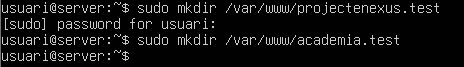
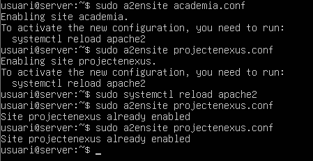
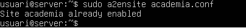

# MISSIÓ APACHE: DESPLEGAMENT MULTIDOMINI I SEGUR

| 1. Instal·lació i Configuració Base |
|----------------------------------------|

- Instal·leu el servidor web Apache sobre la vostra màquina virtual Ubuntu Server.           
Comencem instal·lant les màquines i posant-les en xarxa NAT.           
Ara instal·lem el servei Apache:


- Verifiqueu el funcionament del servei utilitzant la comanda apachectl per comprovar l'estat.           
Comprovem l’estat.


- Assegureu-vos que l'usuari www-data s'ha creat correctament i verifiqueu els
permisos de la carpeta /var/www.


Comprovació de /var/www i /var/www/html


Comprovacions.


| 2. Desplegament de VirtualHosts (Multidomini) |
|----------------------------------------|

- El client té dos dominis: projectenexus.test (Site 1) i academia.test (Site 2).
- Creeu l'estructura de directoris necessària a /var/www/ per allotjar ambdós llocs per separat de manera organitzada.




- Configureu dos VirtualHosts a /etc/apache2/sites-available/ fent servir com a
base l'arxiu de configuració per defecte.      
Entrem als dos arxius i fem els canvis corresponents. 


Que en aquest cas serien aquestes línies:

```

```


Ara el següent arxiu: 




- Activeu els llocs amb la comanda a2ensite i modifiqueu l'arxiu hosts per simular la resolució de noms (DNS) i que els dominis responguin correctament.        
Ara activem els llocs amb les següents comandes i seguidament modifiquem ‘arxiu de hosts i fem les comprovacions corresponents:




[Anar a l'enunciat](../Tasca02/README.md)  
[Anar a la pàgina inicial](../README.md)
