# MISSIÓ APACHE: DESPLEGAMENT MULTIDOMINI I SEGUR

Primerament mostrem les IPs d'ambdues màquines:

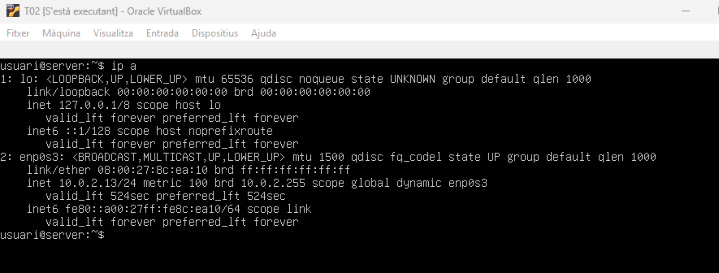

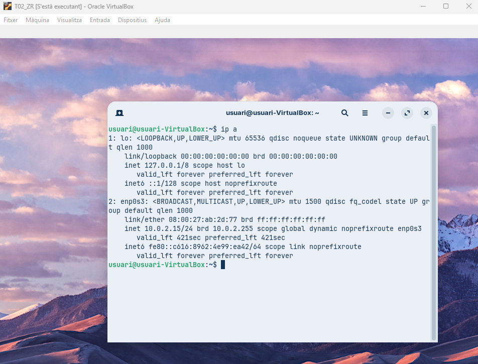

I la prova de connectivitat:

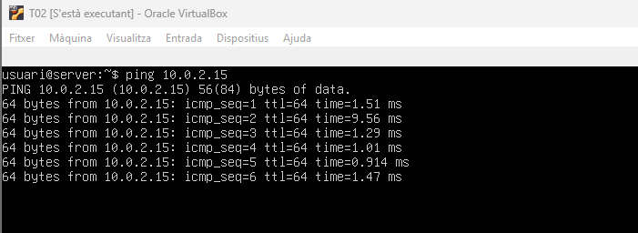

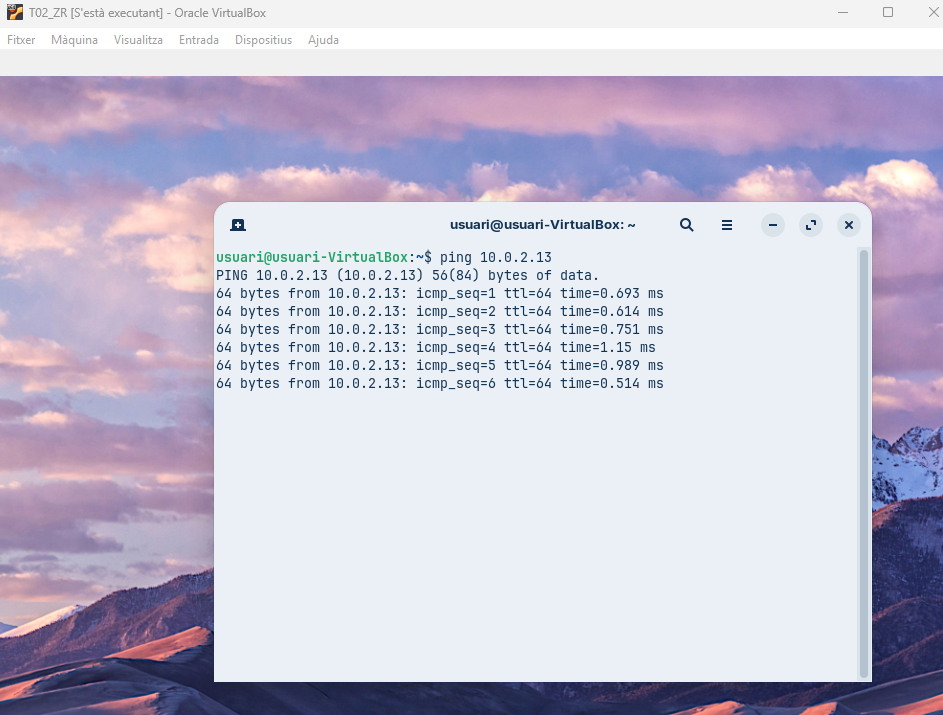

| 1. Instal·lació i Configuració Base |
|----------------------------------------|

- Instal·leu el servidor web Apache sobre la vostra màquina virtual Ubuntu Server.           
Comencem instal·lant les màquines i posant-les en xarxa NAT.           
Ara instal·lem el servei Apache:

```
sudo apt install apache2
```


- Verifiqueu el funcionament del servei utilitzant la comanda apachectl per comprovar l'estat.           
Comprovem l’estat.


- Assegureu-vos que l'usuari www-data s'ha creat correctament i verifiqueu els
permisos de la carpeta /var/www.


Comprovació de /var/www i /var/www/html

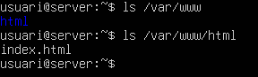

Comprovacions.

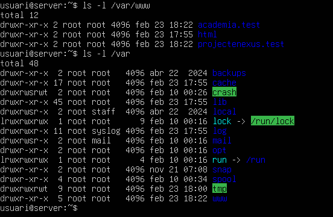

| 2. Desplegament de VirtualHosts (Multidomini) |
|----------------------------------------|

- El client té dos dominis: projectenexus.test (Site 1) i academia.test (Site 2).
- Creeu l'estructura de directoris necessària a /var/www/ per allotjar ambdós llocs per separat de manera organitzada.


Creem un arxiu index.html dins de cada carpeta.

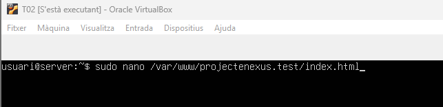

- Configureu dos VirtualHosts a /etc/apache2/sites-available/ fent servir com a
base l'arxiu de configuració per defecte.      
La base és ```000-default.conf``` (la captura le fet després de les creacions, que m’havia oblidat).


I copiem.

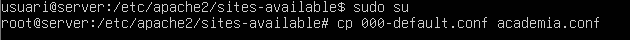

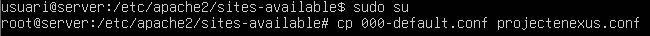

Entrem als dos arxius i fem els canvis corresponents. 

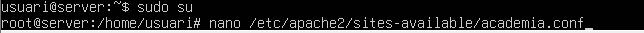

Que en aquest cas serien aquestes línies:

```
ServerName www.academia.test
ServerAdmin webmaster@localhost
DocumentRoot /var/www/academia.test
```

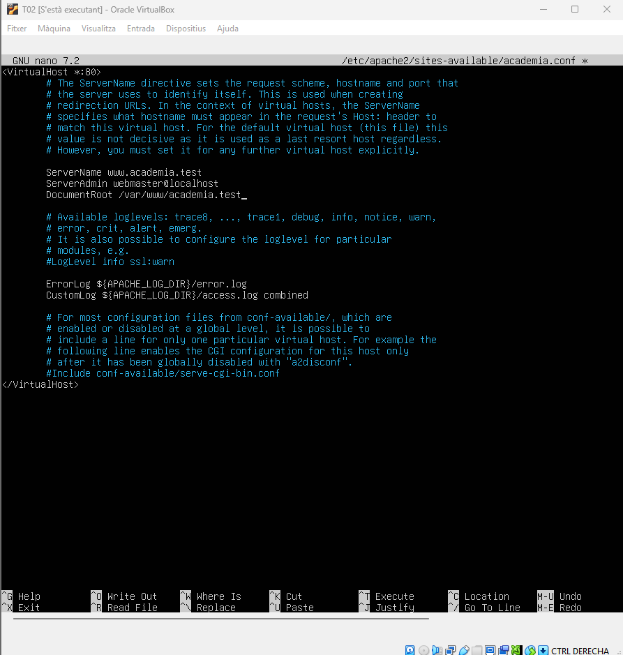

Ara el següent arxiu: 


I les següents línies:

```
ServerName www.projectenexus.test
ServerAdmin webmaster@localhost
DocumentRoot /var/www/projectenexus.test
```

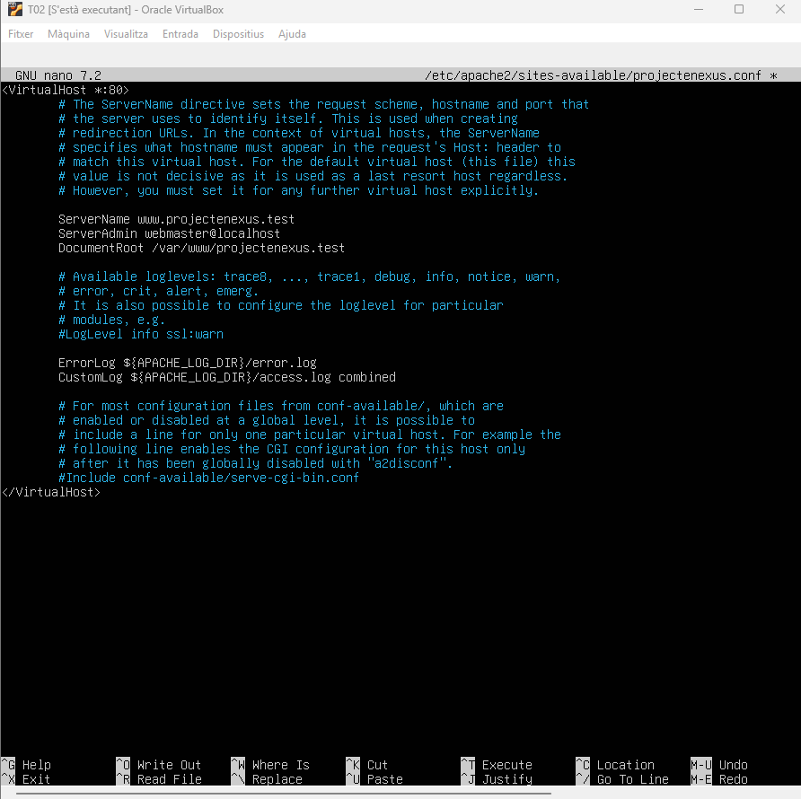

- Activeu els llocs amb la comanda a2ensite i modifiqueu l'arxiu hosts per simular la resolució de noms (DNS) i que els dominis responguin correctament.        
Ara activem els llocs amb les següents comandes i seguidament modifiquem l'arxiu de hosts i fem les comprovacions corresponents:


Entrem a l'arxiu /etc/hosts

```
sudo nano /etc/hosts
```


Fem ```ip a``` per veure l'ip.

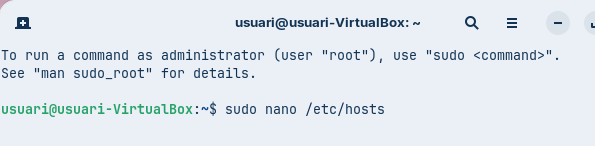

I posem l'ip i el nom dels dos directoris:

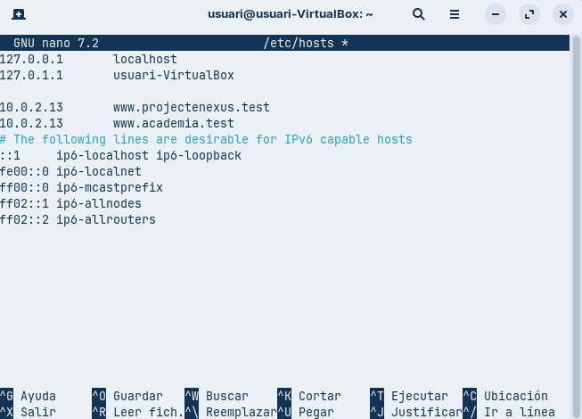

Fem les comprovacions.

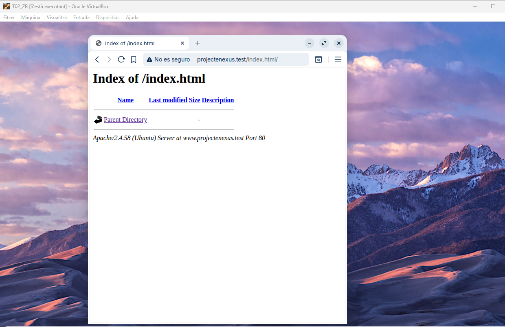

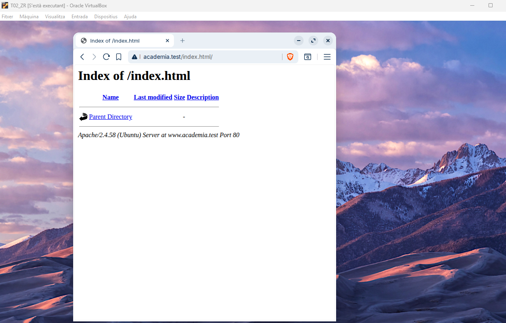

| 3. Personalització d'Errors |
|----------------------------------------|

Configureu una pàgina d'error personalitzada pel codi 404 (Not Found) per a, com a mínim, un dels VirtualHosts. El missatge ha de ser corporatiu i professional, evitant la pàgina per defecte del servidor.       
Configurem una pàgina d’error personalitzada pel codi 404:

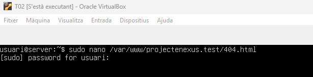

I posem el següent missatge en aquest cas (El típic missatge: Pàgina no encontrada/Not Found), sense accents, ja que si no després surt malament el text:

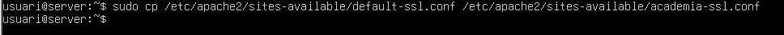

Reiniciem el servei.

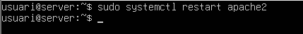

I ara fem el mateix amb l’altre com podem veure:


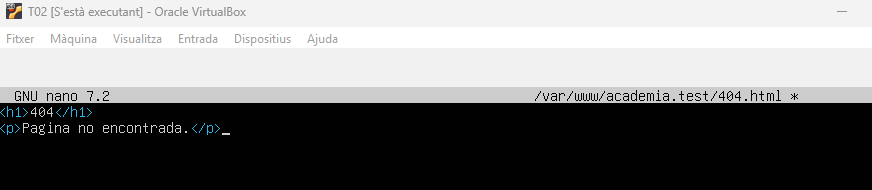

Entrem als arxius conf tant de projectenexus com de academia:

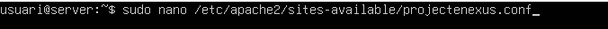

I afegim la següent línia corresponent:

```
ErrorDocument 404 /404.html
```

Quedaria així:

```
ErrorLog ${APACHE_LOG_DIR}/error.log
CustomLog ${APACHE_LOG_DIR}/access.log combined
ErrorDocument 404 /404.html
```

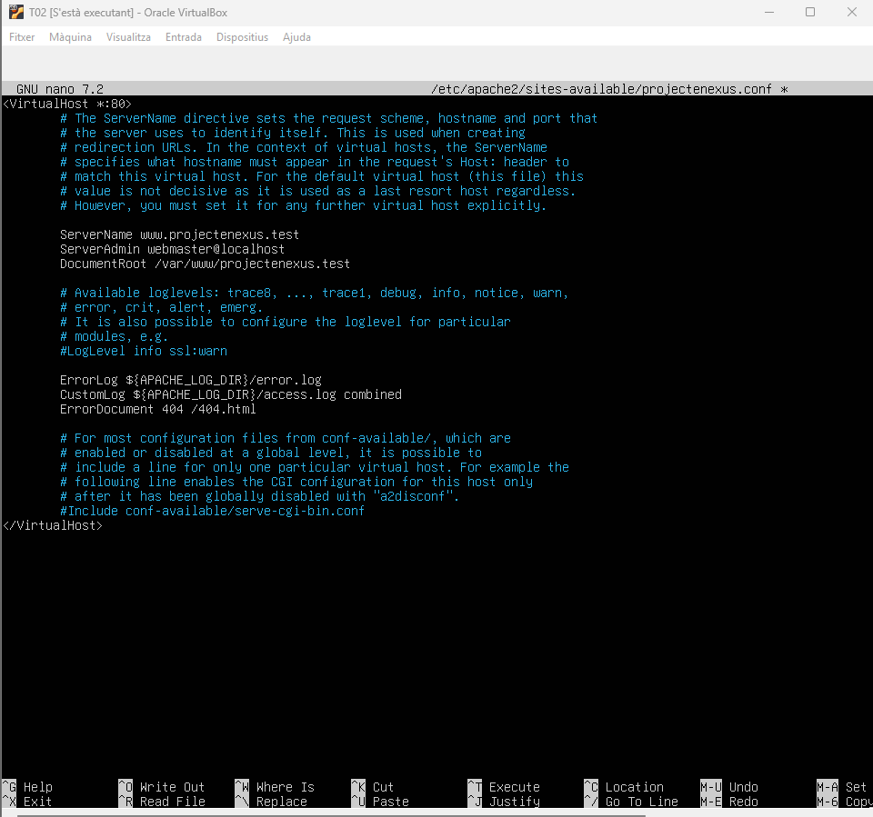

Reiniciem el servei.

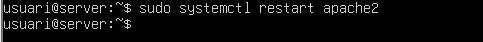

Ara entrem a l’altre arxiu, el de academia:


I afegim la mateixa línia que abans:

```
ErrorDocument 404 /404.html
```

Quedaria així:

```
ErrorLog ${APACHE_LOG_DIR}/error.log
CustomLog ${APACHE_LOG_DIR}/access.log combined
ErrorDocument 404 /404.html
```

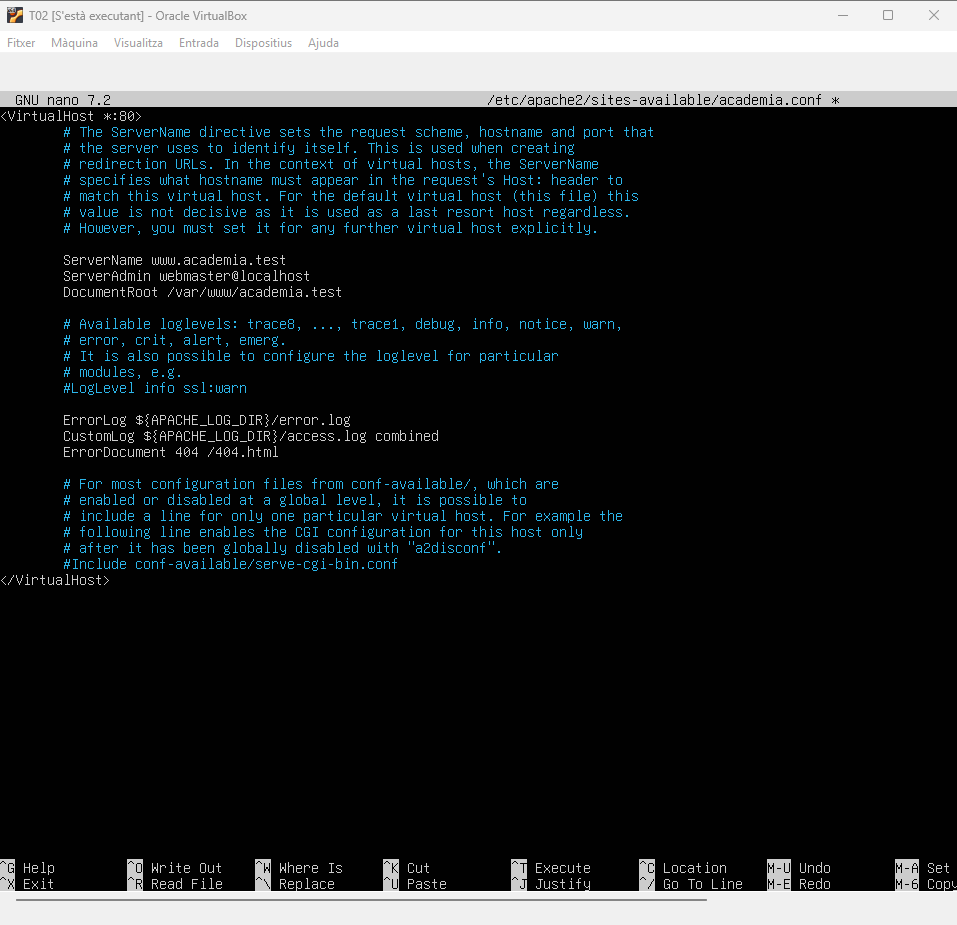

Reiniciem el servei de nou.


Després anem a la màquina Zorin, fem les comprovacions corresponents i com podem veure surten els missatges corresponents a cadascuna:

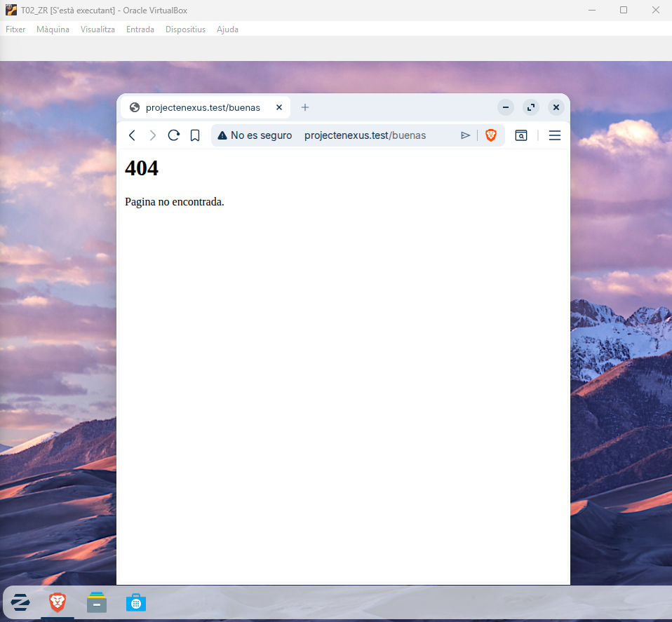

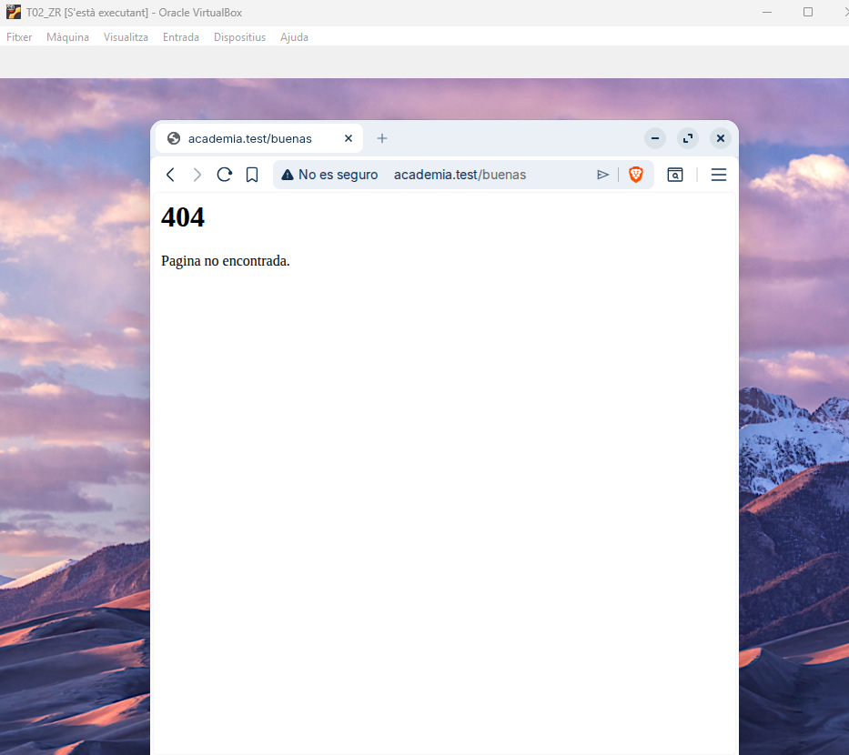

| 4. Seguretat i Certificats (HTTPS) |
|----------------------------------------|

- Habiliteu el mòdul SSL a Apache.        
El que fem és copiar l’arxiu TLS per defecte.


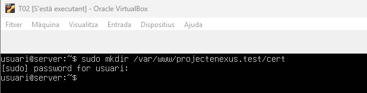

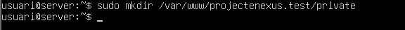

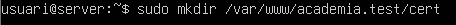


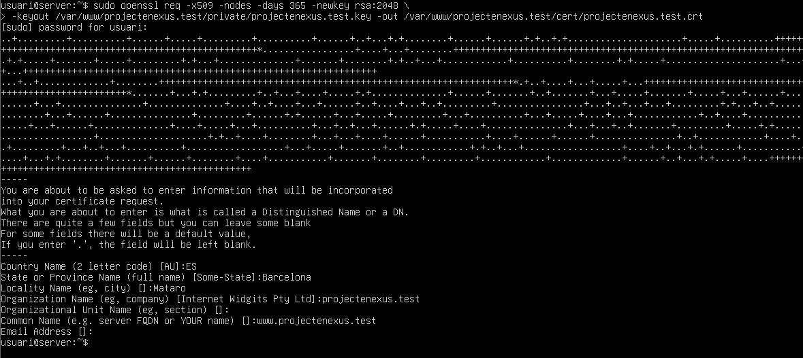

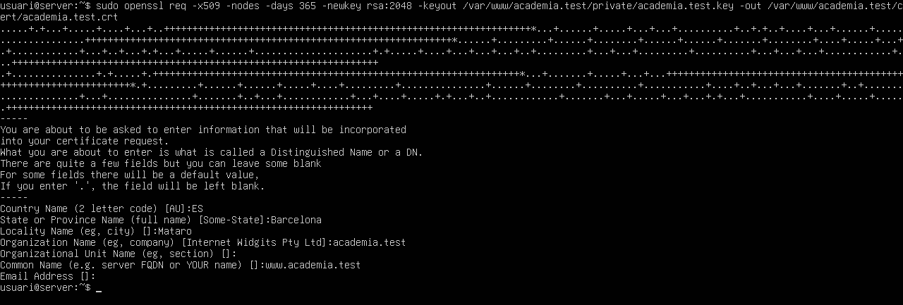

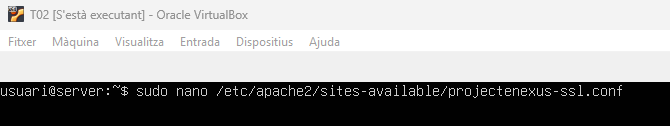

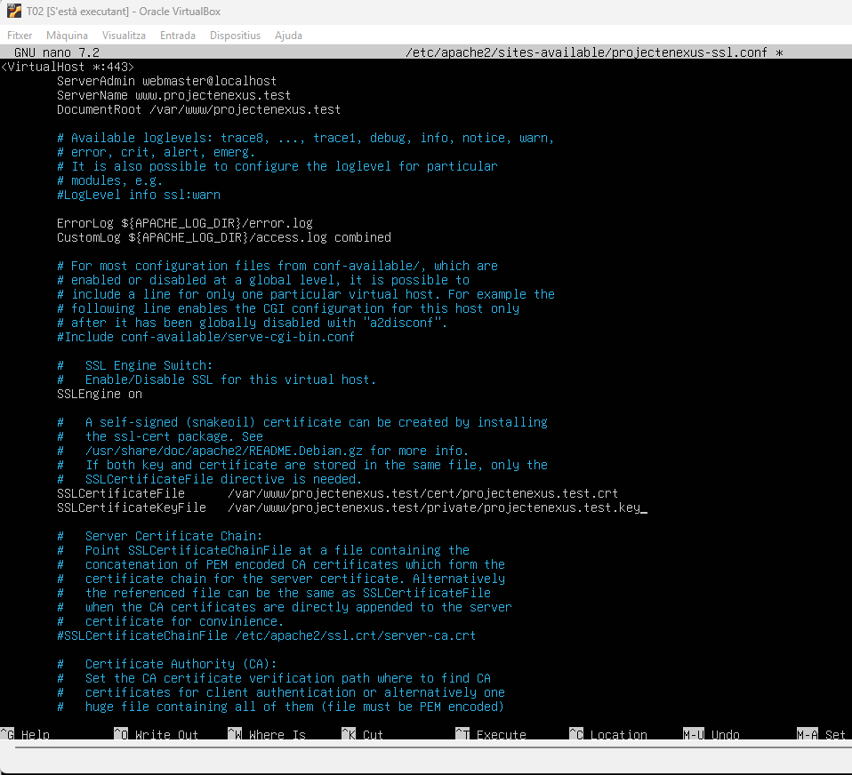

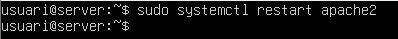


[Anar a l'enunciat](../Tasca02/README.md)  
[Anar a la pàgina inicial](../README.md)
