# MISSIÓ NGINX: MIGRACIÓ D'ALT RENDIMENT I ARQUITECTURA LLEUGERA

Primerament mostrem les IPs d'ambdues màquines:

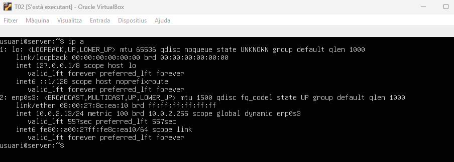

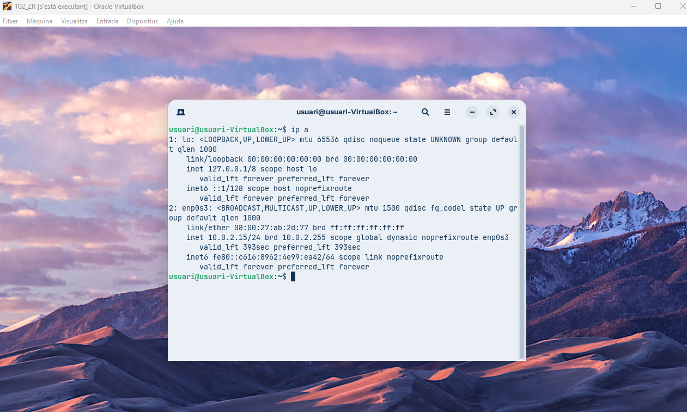

I prova de connectivitat:

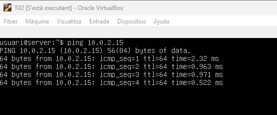

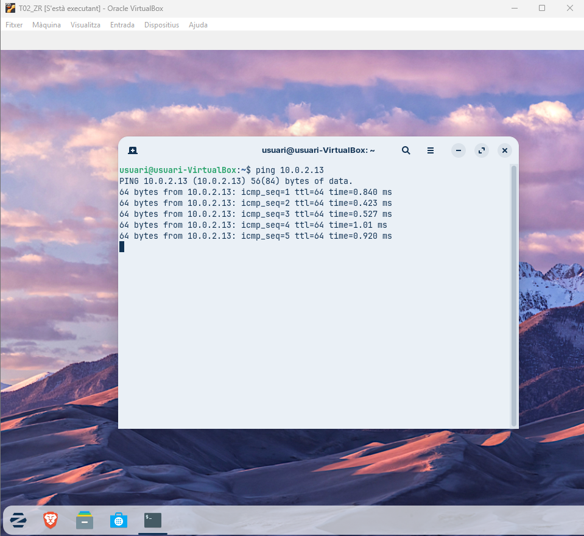

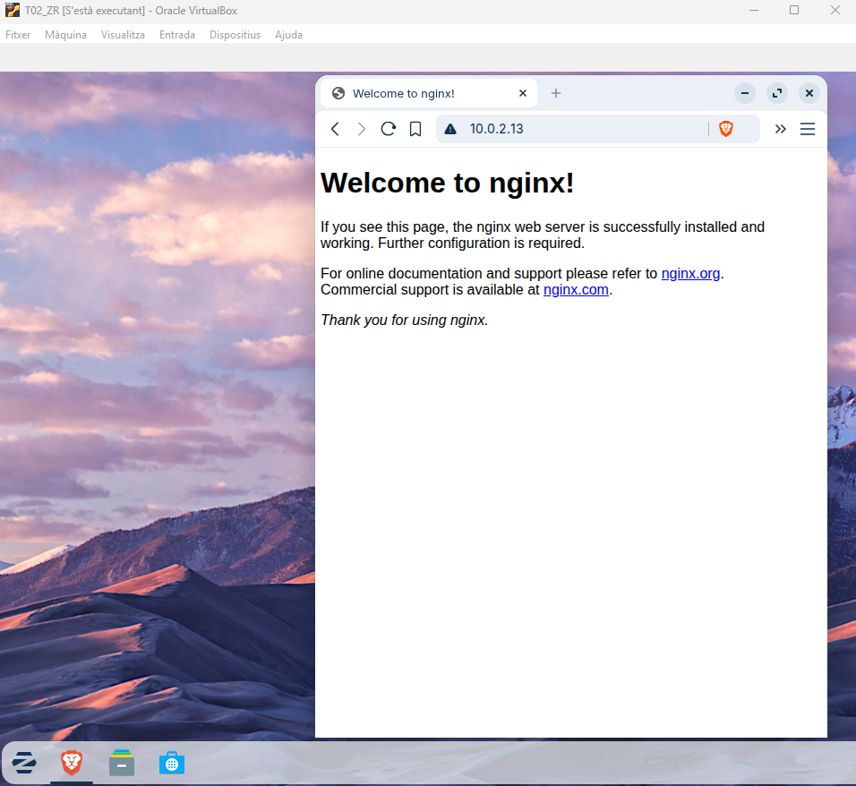

| 1. Preparació de l'Entorn i Instal·lació: |
|----------------------------------------|

- **Atureu i deshabiliteu el servei Apache2 per alliberar els ports 80 i 443.**

Aturem i deshabilitem el servei Apache2 per alliberar els ports 80 i 443 amb les següents comandes (fem també amb now perquè ho faci en aquest moment).

```
sudo systemctl stop apache2
```

```
sudo systemctl disable apache2
```

```
sudo systemctl disable apache2 now
```


- **Instal·leu el servidor web Nginx.**

Instal·lem el servidor web Nginx amb la següent comanda:

```
sudo apt install nginx -y
```


- **Verifiqueu que el servei està actiu i que la pàgina de benvinguda de Nginx es mostra correctament al navegador.**

Verifiquem que el servei està actiu i que la pàgina de benvinguda de Nginx es mostra correctament al navegador:


Perquè la pàgina de benvinguda de Nginx es mostri correctament editem el següent arxiu de configuració:


Editem la següent línia:

```
root /usr/share/nginx/html
```


Comprovem la sintaxi i reiniciem el servei:


Fem ```ip a```, bàsicament per veure l’ip i posar-la al navegador de la máquina zorin per fer la comprovació.


Comprovem que la pàgina de benvinguda de Nginx es mostra correctament al navegador:


| 2. Configuració de Server Blocks (Multidomini) |
|----------------------------------------|

- **Aprofiteu l'estructura de carpetes ja creada (/var/www/nexus i /var/www/academia). Si cal, ajusteu els permisos (propietari www-data).**

Aprofitem l'estructura de carpetes ja creada (/var/www/nexus i /var/www/academia). Primerament ajustem els permisos (propietari www-data):


- **Configureu dos Server Blocks (l'equivalent a VirtualHosts a Nginx) a /etc/nginx/sites-available/.**

A la carpeta ```/etc/nginx/sites-available``` tenim l’arxiu del servidor per defecte default, la cual utilitzarem com plantilla per crear els nostres propis per això el que fem és copiar aquest arxiu per crear els dos que necessitem dins de la carpeta sites-available.


Configurem dos Server Blocks (l'equivalent a VirtualHosts a Nginx) a ```/etc/nginx/sites-available/``` corresponentment:


Editem les següents línies:

```
server {
        listen 80;
        listen [::]:80;
```

```
root /var/www/projectenexus.test;
```

```
server_name www.projectenexus.test;
```


Reiniciem el servei


Editem les següents línies:

```
server {
        listen 80;
        listen [::]:80;
```

```
root /var/www/academia.test;
```

```
server_name www.academia.test;
```


- **Creeu els enllaços simbòlics a sites-enabled/ per activar les configuracions.          
Verifiqueu la sintaxis amb nginx -t abans de reiniciar el servei.**

Creem els enllaços simbòlics a ```sites-enabled/``` per activar les configuracions i seguidament verifiquem la sintaxis amb ```nginx -t``` i després d’això reiniciem el servei.


Ara editarem l’arxiu ```/etc/nginx/nginx.conf``` i activem la següent linia, això per evitar problemes de memòria quan es treballa amb diversos noms.


```
server_names_hash_bucket_size 64;
```


Verifiquem la sintaxis amb ```nginx -t``` i després d’això reiniciem el servei.


Comprovem la IP de l’arxiu ```/etc/hosts``` de la màquina Zorin.

```
sudo nano /etc/hosts
```


| 3. Personalització d'Errors |
|----------------------------------------|

- **Configureu la directiva error_page 404 dins del bloc de servidor corresponent.**

Configurem la directiva error_page 404 dins del bloc de servidor corresponent.


Editem/posem les següents línies per això:

```
server_name www.projectenexus.test;
error_page 404 /404.html
location / {
```

```
}
location = /404.html {
        internal;
}
```


Reiniciem el servei:


Configurem la directiva error_page 404 dins del bloc de servidor corresponent:


Editem/posem les següents línies:

```
server_name www.projectenexus.test;
error_page 404 /404.html
location / {
```

```
}
location = /404.html {
        internal;
}
```


Reiniciem el servei:


- **Assegureu-vos que, quan es demani un fitxer inexistent, es mostri la pàgina d'error personalitzada que vau crear anteriorment.**

Comprovacions:


Ara desde la terminal fem una prova de connexió errònia via terminal amb ```curl -L``` i observem com es mostra la redirecció:


| 4. Seguretat i Certificats (HTTPS) |
|----------------------------------------|

- **Reutilitzeu els certificats SSL generats en l'activitat anterior (o genereu-ne de nous si cal).**

Reutilitzem els certificats SSL generats en l'activitat anterior.

- **Configureu el Server Block per escoltar al port 443 i indiqueu les rutes del certificat (ssl_certificate) i la clau privada (ssl_certificate_key).**

Configurem el Server Block per escoltar al port 443 i indiquem les rutes del certificat (ssl_certificate) i la clau privada (ssl_certificate_key).

Primerament fem un ```cp```:


Entrem a l'arxiu per fer les configuracions corresponents:


Posem les següents línies corresponents:

```
server {
        listen 443 ssl;
```

```
server_name www.projectenexus.test;
root /var/www/projectenexus.test;
```

```
ssl_certificate /var/www/projectenexus.test/cert/projectenexus.crt;
ssl_certificate_key /var/www/projectenexus.test/private/projectenexus.key;
ssl_protocols       TLSv1.2 TLSv1.3;
error_page 404 /404.html;
location / {
```


Verifiquem la sintaxis amb ```nginx -t``` i després d’això reiniciem el servei.


Habilitarem els sites creant l’enllaç simbòlic cap a la carpeta ```sites-enabled```.


Amb ```ln```, però ja surt.


Verifiquem la sintaxis amb ```nginx -t``` i després d’això reiniciem el servei.

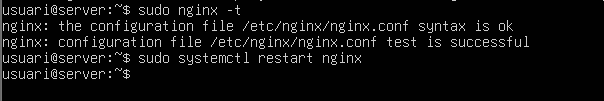

Ara amb academia el mateix procediment:

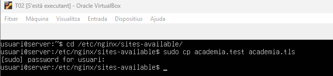

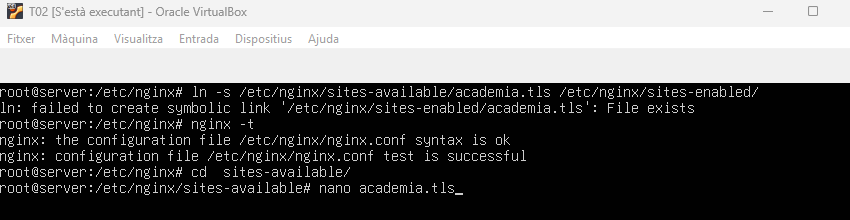

Posem les següents línies corresponents:

```
server {
        listen 443 ssl;
```

```
server_name www.academia.test;
root /var/www/academia.test;
```

```
ssl_certificate /var/www/academia.test/cert/academia.crt;
ssl_certificate_key /var/www/academia.test/private/academia.key;
ssl_protocols       TLSv1.2 TLSv1.3;
error_page 404 /404.html;
location / {
```

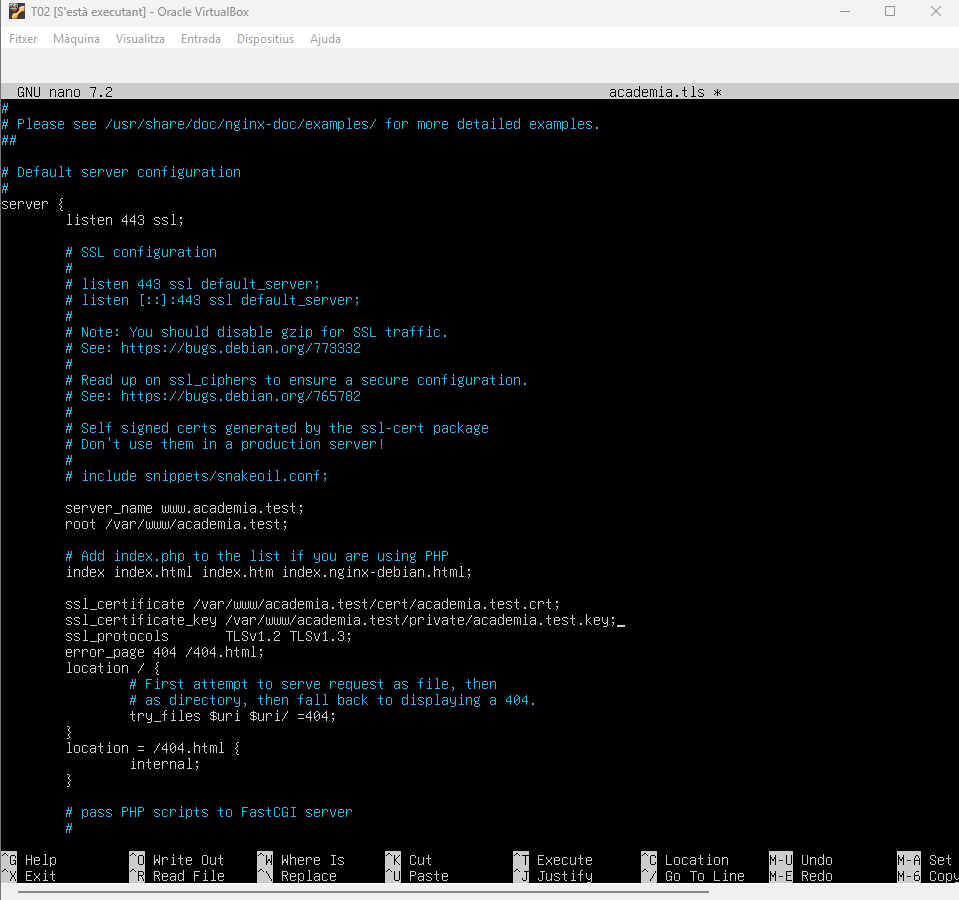

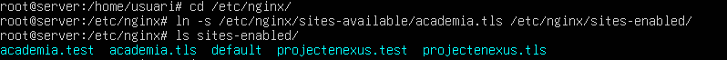

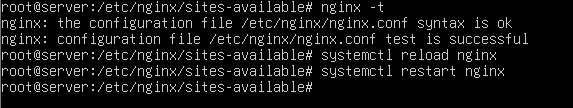

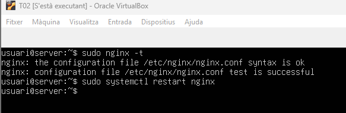

- **Redirecció forçada: Configureu un bloc de servidor escoltant al port 80 queretorni un codi 301 (Permanent Redirect) cap a la versió HTTPS del domini projectenexus.test o academia.test.**

Configurem un bloc de servidor escoltant al port 80 que retorni un codi 301 (Permanent Redirect) cap a la versió HTTPS del domini projectenexus.test o academia.test.

Primerament configurem l’arxiu:


Posem les següents línies corresponents:

```
server {
        listen 80;
        listen [::]:80;
        server_name www.projectenexus.test;
        return 301 https://www.projectenexus.test$request_uri;
```

```
root /var/www/projectenexus.test;
```

```
error_page 404 /404.html;
location / {
```

```
}
location = /404.html {
        internal;
}
```

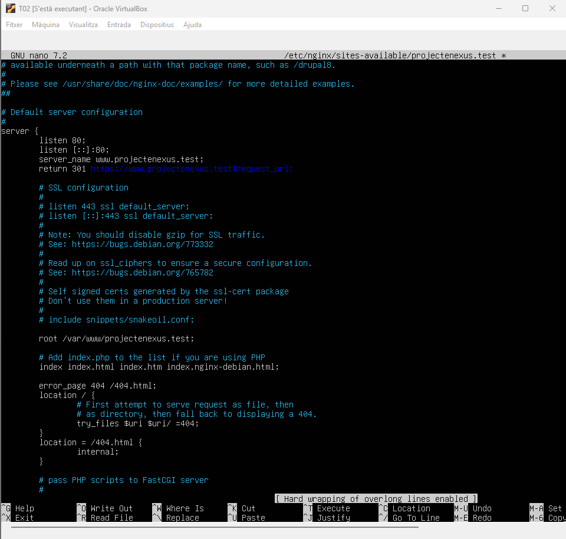

Verifiquem la sintaxis amb ```nginx -t``` i després d’això reiniciem el servei.

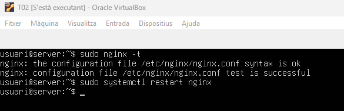

Desde la màquina Zorin fem comprovació amb ```curl -k -I```

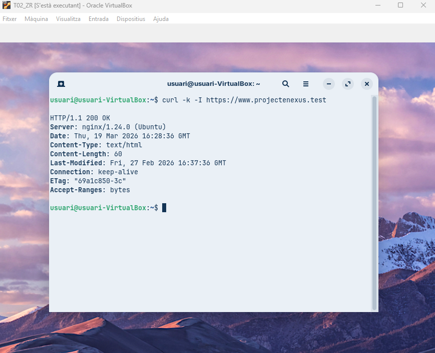

Amb academia ja seria el mateix procediment:

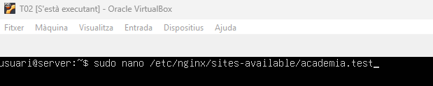

Posem les següents línies corresponents:

```
server {
        listen 80;
        listen [::]:80;
        server_name www.academia.test;
        return 301 https://www.academia.test$request_uri;
```

```
root /var/www/academia.test;
```

```
error_page 404 /404.html;
location / {
```

```
}
location = /404.html {
        internal;
}
```

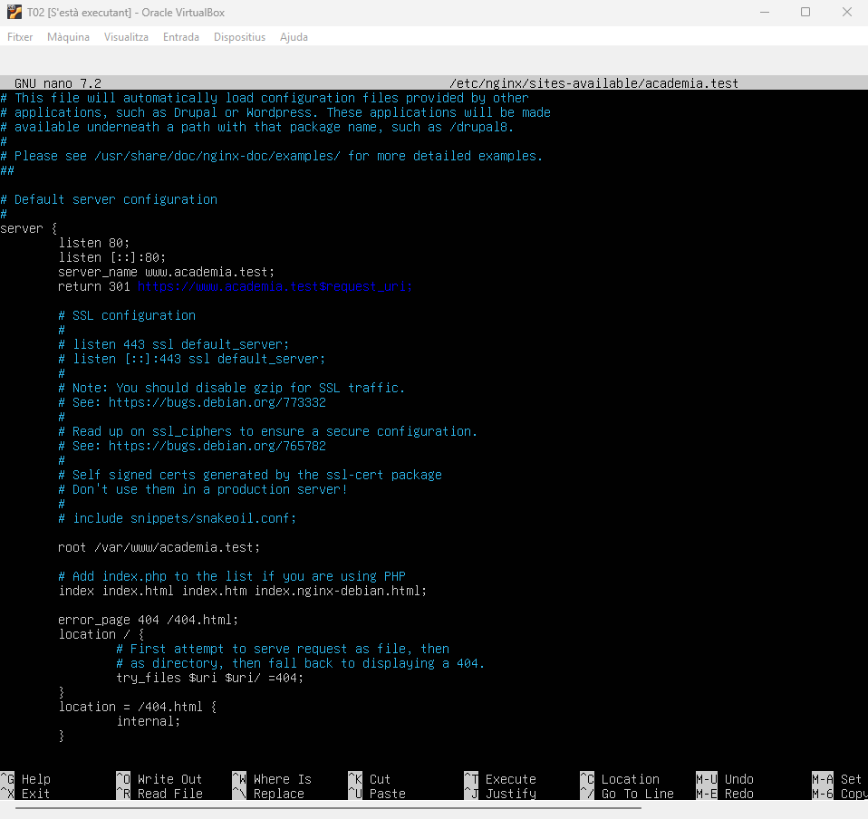

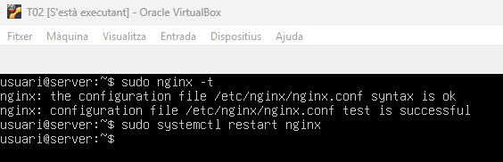

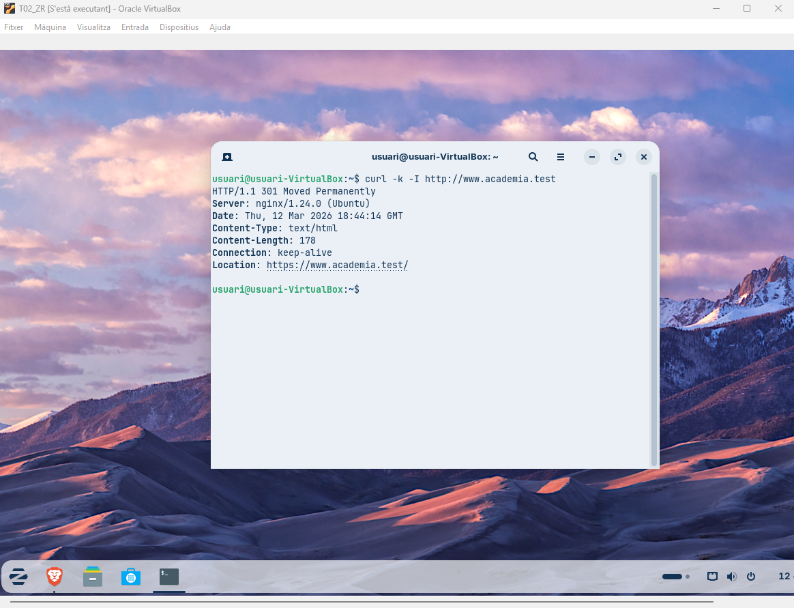

| 5. Optimització amb HTTP/2 |
|----------------------------------------|

- **Habiliteu el protocol HTTP/2 afegint el paràmetre http2 a la directiva listen del bloc SSL.**

- **Comproveu novament amb les eines de desenvolupador del navegador que el contingut s'està servint amb aquest protocol.**

[Anar a l'enunciat](../Tasca03/README.md)  
[Anar a la pàgina inicial](../README.md)

