# MISSIÓ APACHE: DESPLEGAMENT MULTIDOMINI I SEGUR

| 1. Instal·lació i Configuració Base |
|----------------------------------------|

- Atureu i deshabiliteu el servei Apache2 per alliberar els ports 80 i 443.

Aturem i deshabilitem el servei Apache2 per alliberar els ports 80 i 443 amb les següents comandes (fem també amb now perquè ho faci en aquest moment).

```
sudo systemctl stop apache2
```

```
sudo systemctl disable apache2
```

```
sudo systemctl disable apache2 now
```


- Instal·leu el servidor web Nginx.

Instal·lem el servidor web Nginx amb la següent comanda:

```
sudo apt install nginx -y
```


- Verifiqueu que el servei està actiu i que la pàgina de benvinguda de Nginx es mostra correctament al navegador.

Verifiquem que el servei està actiu i que la pàgina de benvinguda de Nginx es mostra correctament al navegador:


Perquè la pàgina de benvinguda de Nginx es mostri correctament editem el següent arxiu de configuració:


Editem la següent línia:

```
root /usr/share/nginx/html
```


Comprovem la sintaxi i reiniciem el servei:


Fem ip a, bàsicament per veure l’ip i posar-la al navegador de la máquina zorin per fer la comprovació.


Comprovem que la pàgina de benvinguda de Nginx es mostra correctament al navegador:


| 2. Configuració de Server Blocks (Multidomini) |
|----------------------------------------|

- Aprofiteu l'estructura de carpetes ja creada (/var/www/nexus i /var/www/academia). Si cal, ajusteu els permisos (propietari www-data).

Primerament ajustem els permisos (propietari www-data):


- Configureu dos Server Blocks (l'equivalent a VirtualHosts a Nginx) a /etc/nginx/sites-available/.

A la carpeta ```/etc/nginx/sites-available``` tenim l’arxiu del servidor per defecte default, la cual utilitzarem com plantilla per crear els nostres propis per això el que fem és copiar aquest arxiu per crear els dos que necessitem dins de la carpeta sites-available.


Configurem dos Server Blocks (l'equivalent a VirtualHosts a Nginx) a /etc/nginx/sites-available/ corresponentment:


```
server {
        listen 80;
        listen [::]:80;
```

```
root /var/www/projectenexus.test;
```

```
server_name www.projectenexus.test.test;
```


Reiniciem el servei


```
server {
        listen 80;
        listen [::]:80;
```

```
root /var/www/academia.test;
```

```
server_name www.academia.test.test;
```


- Creeu els enllaços simbòlics a sites-enabled/ per activar les configuracions.          
Verifiqueu la sintaxis amb nginx -t abans de reiniciar el servei.

Creem els enllaços simbòlics a sites-enabled/ per activar les configuracions i seguidament verifiquem la sintaxis amb nginx -t i després d’això reiniciem el servei.


Ara editarem l’arxiu /etc/nginx/nginx.conf i activem la següent linia, això per evitar problemes de memòria quan es treballa amb diversos noms.

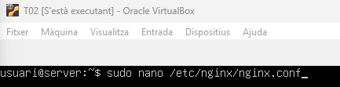

```
server_names_hash_bucket_size 64;
```

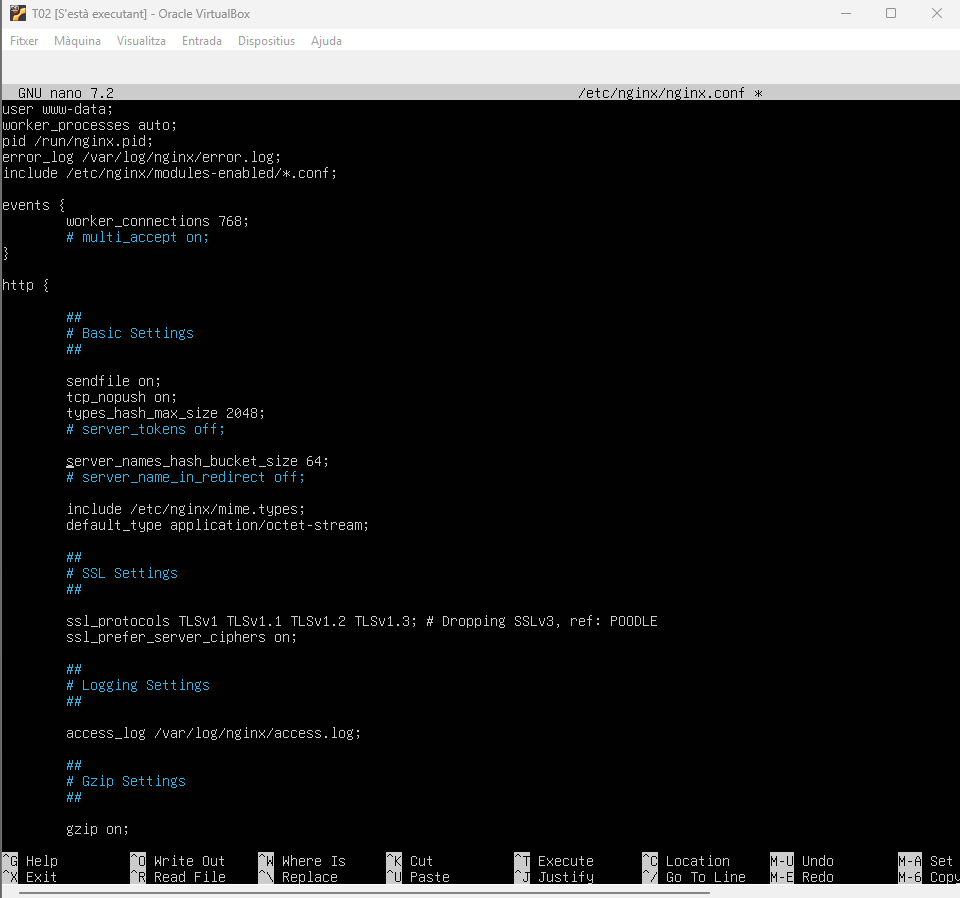

Verifiquem la sintaxis amb nginx -t i després d’això reiniciem el servei.

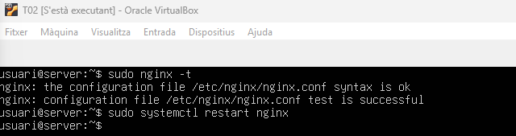

Comprovem la IP de l’arxiu /etc/hosts de la màquina Zorin.

```
sudo nano /etc/hosts
```


| 3. Personalització d'Errors |
|----------------------------------------|

- Configureu la directiva error_page 404 dins del bloc de servidor corresponent.


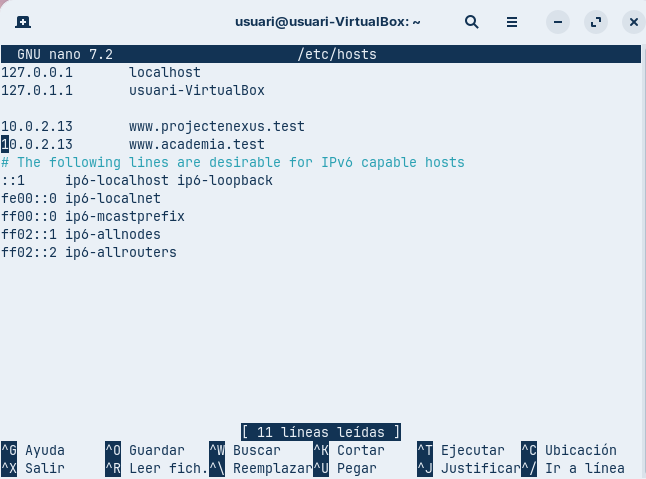

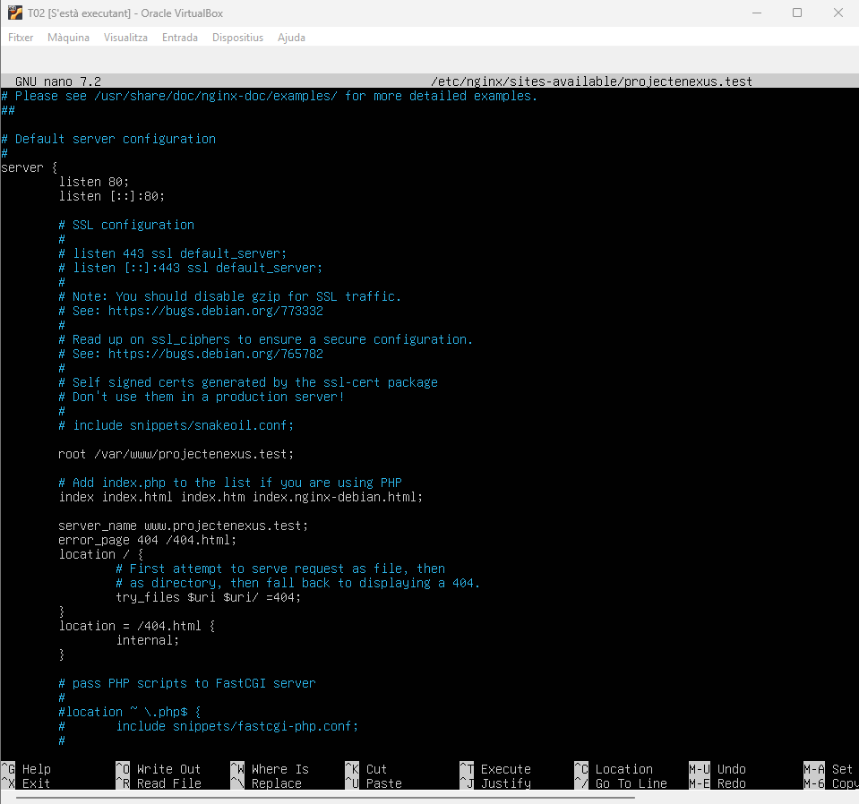

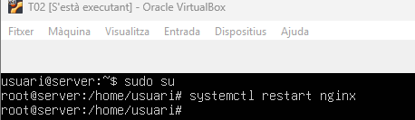

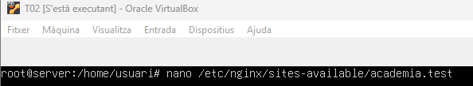

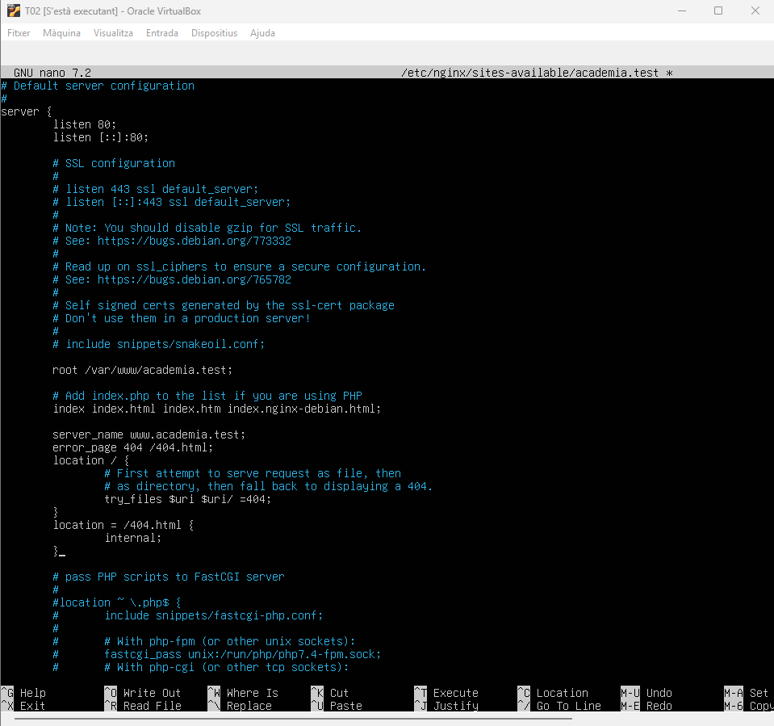

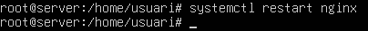

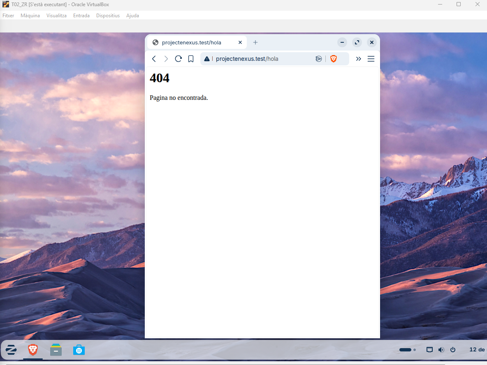


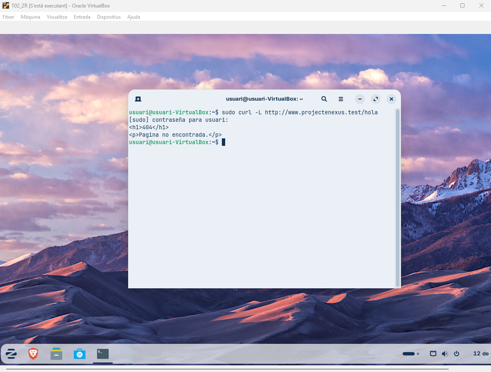


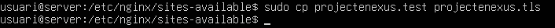

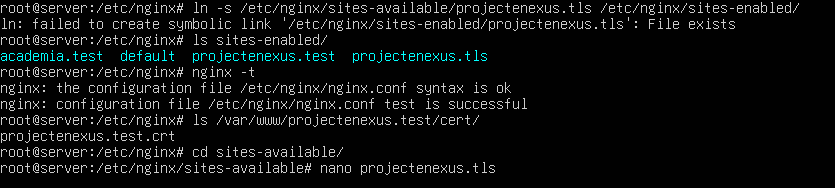

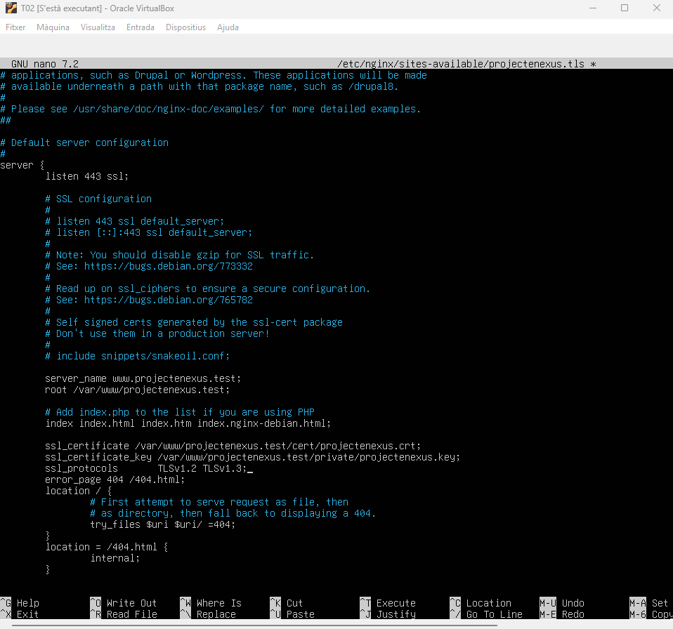

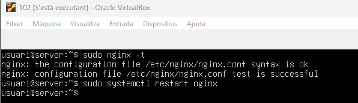

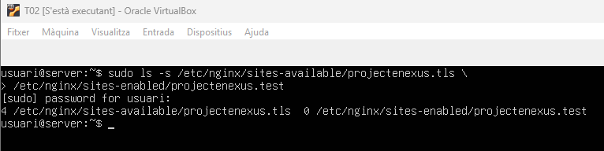

[Anar a l'enunciat](../Tasca03/README.md)  
[Anar a la pàgina inicial](../README.md)

