# MISSIÓ APACHE: DESPLEGAMENT MULTIDOMINI I SEGUR

| 1. Instal·lació i Configuració Base |
|----------------------------------------|

- Atureu i deshabiliteu el servei Apache2 per alliberar els ports 80 i 443.

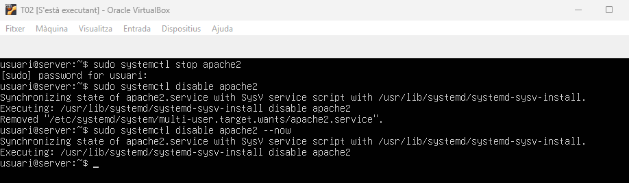

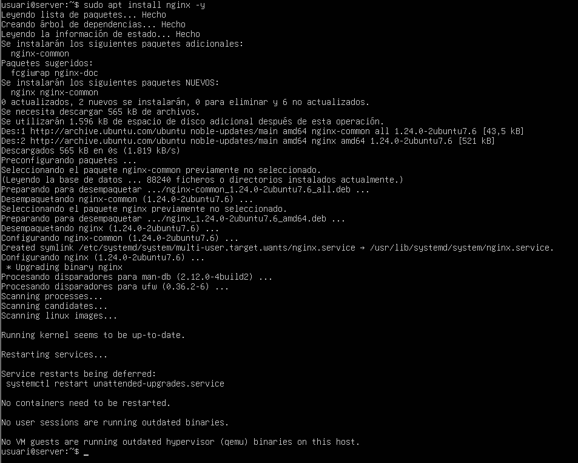

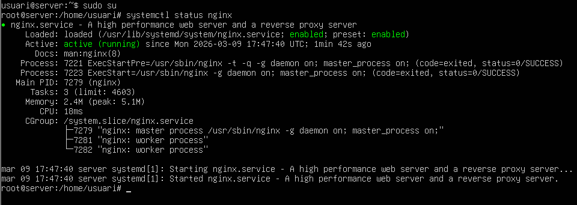

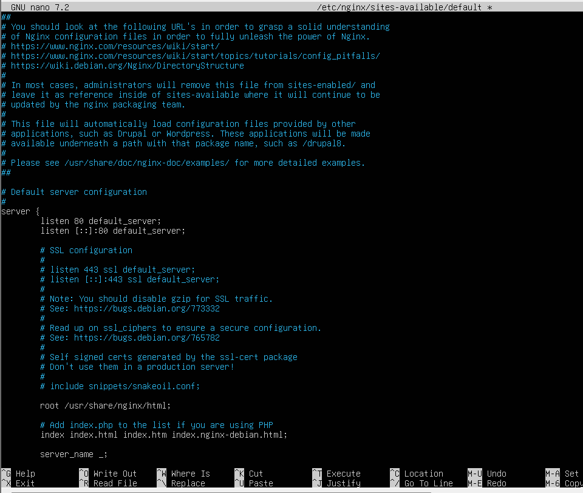

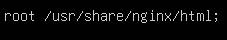

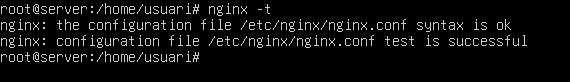

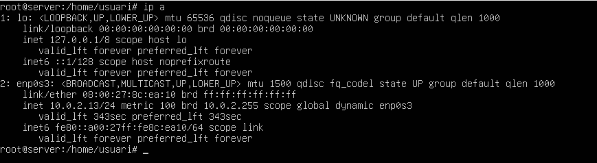

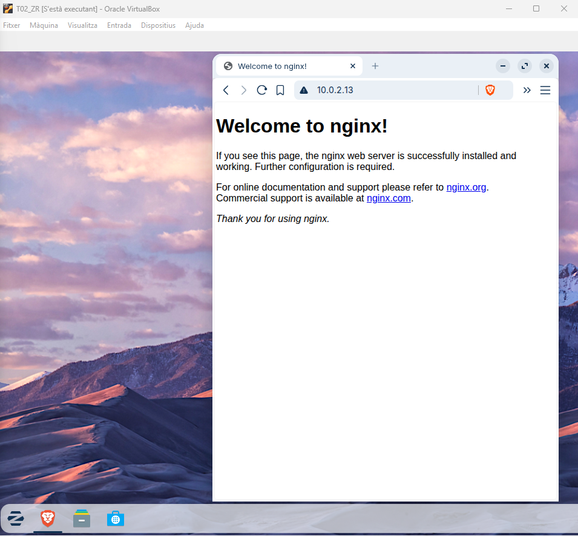

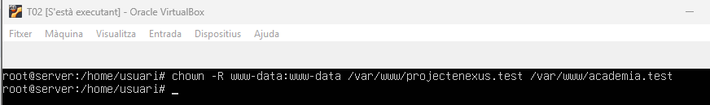

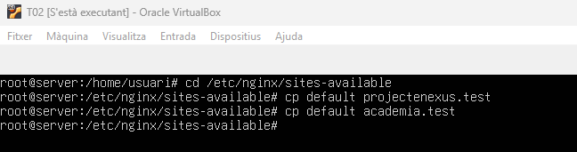

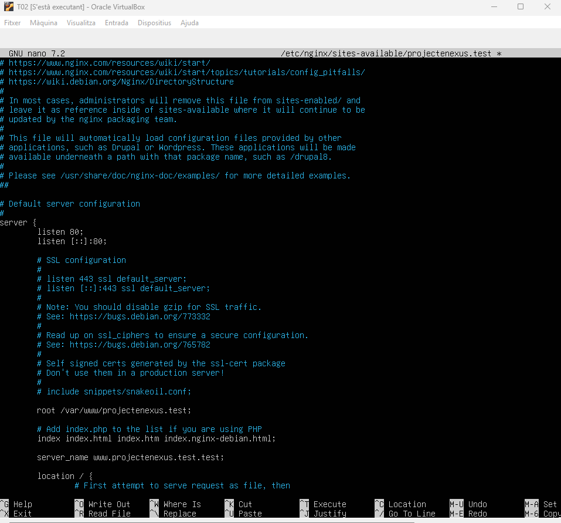

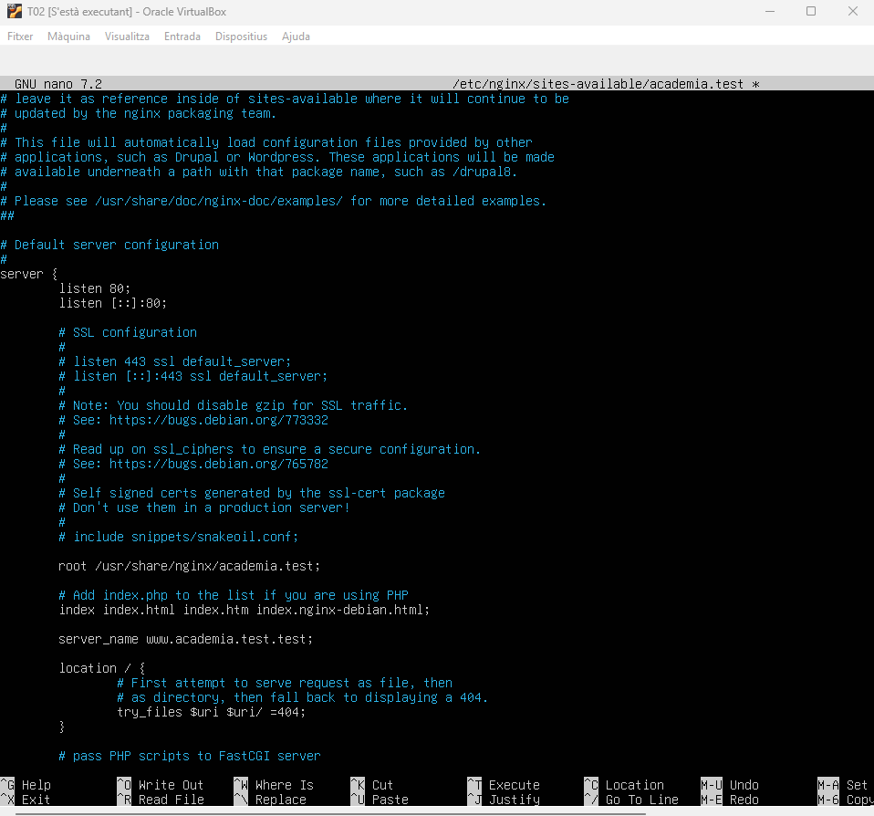

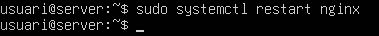

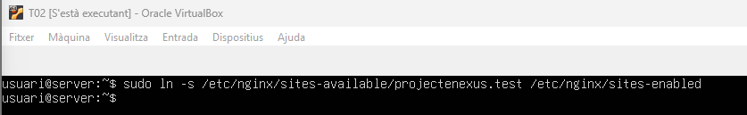

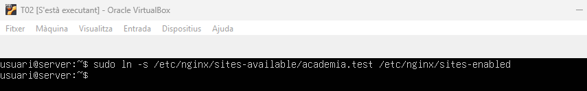

[Anar a l'enunciat](../Tasca03/README.md)  
[Anar a la pàgina inicial](../README.md)

