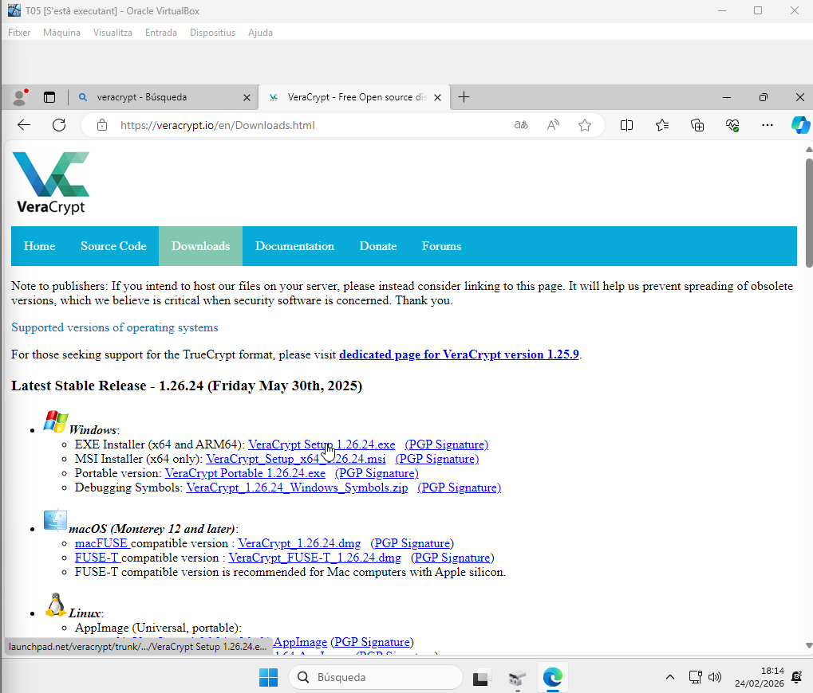
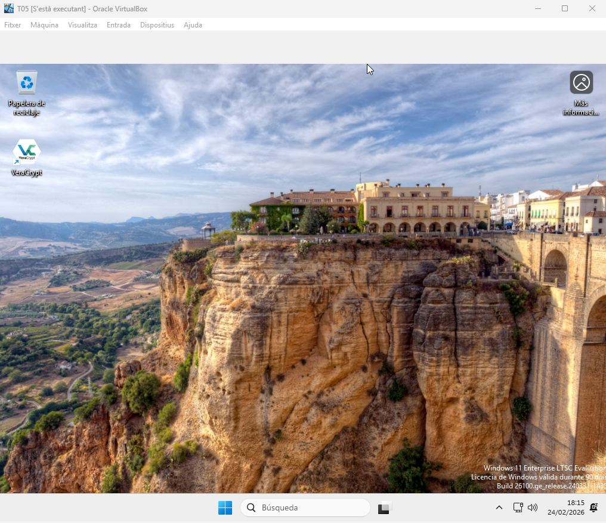
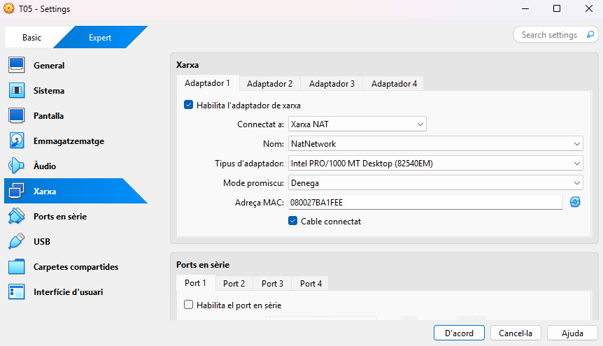
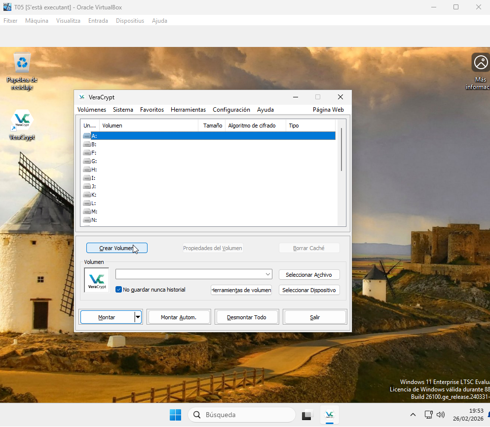
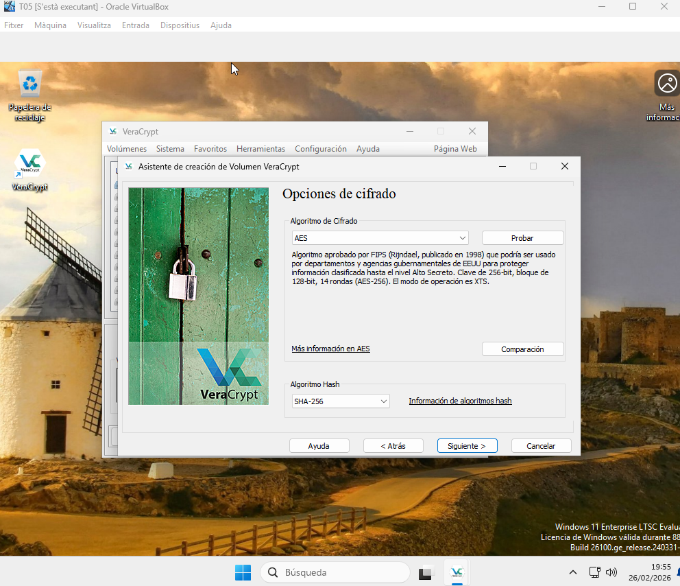
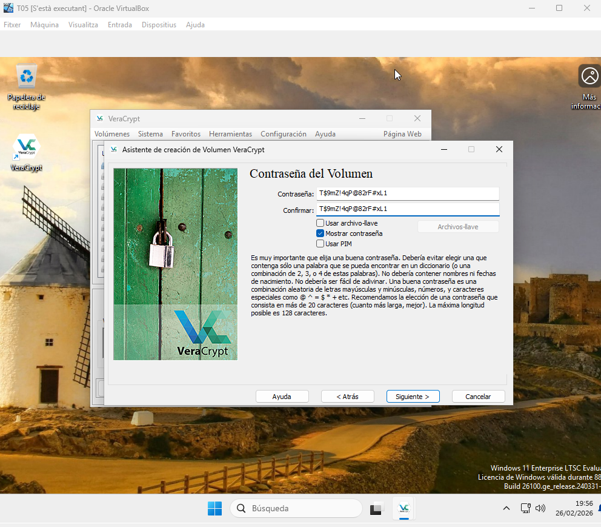

TOP SECRET, PROTEGINT ELS SECRETS

Introducció

Aprofitant que ja hi esteu treballant amb la seva infraestructura web, des de Projecte Nexus us sol·licita una nova petició d’ajuda.

A causa del gran volum de dades sensibles que gestionen (dades personals d'estudiants,

exàmens oficials no publicats i certificats de notes), estan molt preocupats per la integritat i privacitat de la seva gestió acadèmica.

La direcció de Projecte Nexus us ha demanat una demostració pràctica de com la vostra empresa pot garantir els tres pilars de la seguretat en la seva informació: Confidencialitat, Integritat i Autenticitat.

Descripció de l'activitat

Tasca 1: Protecció de dades en repòs (Xifratge Simètric)

Els caps de departament necessiten transportar els exàmens finals en memòries USB per imprimir-los a secretaria, però tenen por de perdre el dispositiu i que les preguntes es filtrin abans de la data de la prova.

Heu de crear un contenidor xifrat (unitat virtual) dins d'un pendrive (simulat al disc dur)

utilitzant el programari VeraCrypt (o similar).

Requisits:

- Crear un volum de 100MB.             

[Anar a l'enunciat](../Tasca02/README.md)  
[Anar a la pàgina inicial](../README.md)
