# PROJECTE NEXUS. IMPLANTACIÓ DE PKI I SIGNATURA DIGITAL CORPORATIVA

## Guia de l’activitat

### Fase 1: Preparació de l'entorn de laboratori

#### 1. Instal·lar Ubuntu Server i Windows 11 a les màquines virtuals. Configurar dues interfícies de xarxa: una en NAT (DHCP) per tenir accés a Internet i una segona perquè es puguin comunicar les dues màquines.

Hem posat les dues xarxes en: Nat la primera i la segona en adaptador pont.

#### 2. Configurar l’adaptador pont amb IP estàtica al servidor i al client segons l’esquema següent:

Ip: 192.168.4.y
Màscara: 255.255.255.0

Màquina servidor:

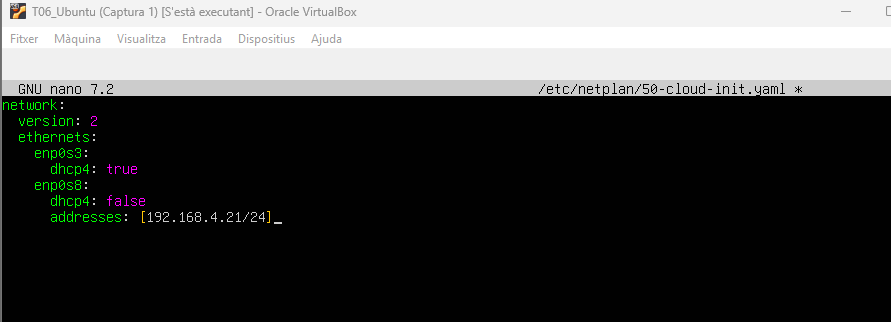
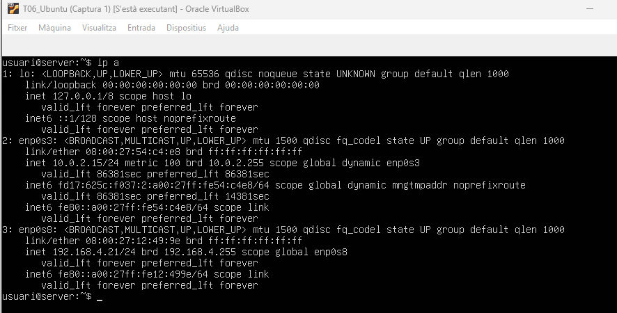

Màquina client:

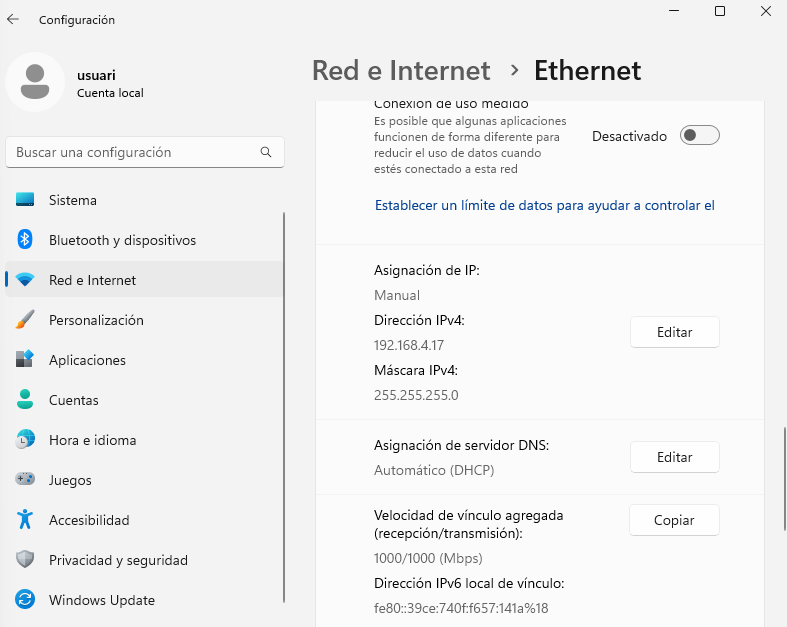

#### On "y" és el vostre número de llista (un instal·la el Server i l’altre el Windows 11).
#### No posem ni gateway ni DNS perquè la sortida a Internet es farà amb l’adaptador NAT.
#### 3. Canviar el nom del servidor a: ca.nexusX.test (on X és el número del vostre grup).

Canviem el nom del servidor a: ca.nexusX.test (on X és el número del nostre grup). Som el grup: 12.

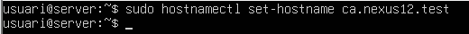
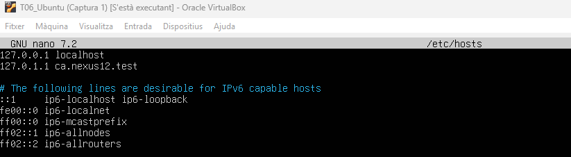

Comprovacions:

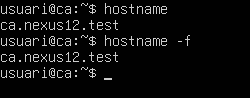

#### 4.Configurar al client l’arxiu hosts per resoldre el nom del servidor web (ca.nexusX.test) a la seva IP.
#### Important: És molt recomanable crear snapshots de les màquines abans de començar.

Configurem al client l’arxiu hosts per resoldre el nom del servidor web (ca.nexusX.test) a la seva IP:

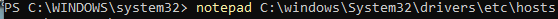
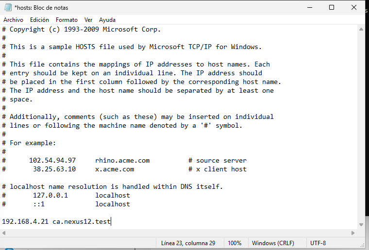

### Fase 2: Creació de l’Entitat de Certificació (CA)

#### 1. Editar l’arxiu de configuració d’OpenSSL (/etc/ssl/openssl.cnf) i afegir la configuració de la CA:
#### 𝑐𝑎]𝑑𝑒𝑓𝑎𝑢𝑙𝑡_𝑐𝑎=𝐶𝐴_𝑑𝑒𝑓𝑎𝑢𝑙𝑡\[𝐶𝐴_𝑑𝑒𝑓𝑎𝑢𝑙𝑡]𝑑𝑖𝑟=/𝑒𝑡𝑐/𝑠𝑠𝑙/𝐶𝐴𝑐𝑒𝑟𝑡𝑠=/𝑒𝑡𝑐/𝑠𝑠𝑙/𝐶𝐴/𝑐𝑒𝑟𝑡𝑠𝑐𝑟𝑙_𝑑𝑖𝑟=/𝑒𝑡𝑐/𝑠𝑠𝑙/𝐶𝐴/𝑐𝑟𝑙𝑑𝑎𝑡𝑎𝑏𝑎𝑠𝑒=/𝑒𝑡𝑐/𝑠𝑠𝑙/𝐶𝐴/𝑖𝑛𝑑𝑒𝑥.𝑡𝑥𝑡

Editem l’arxiu de configuració d’OpenSSL (/etc/ssl/openssl.cnf) i afegim la configuració de la CA corresponent:

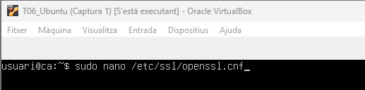
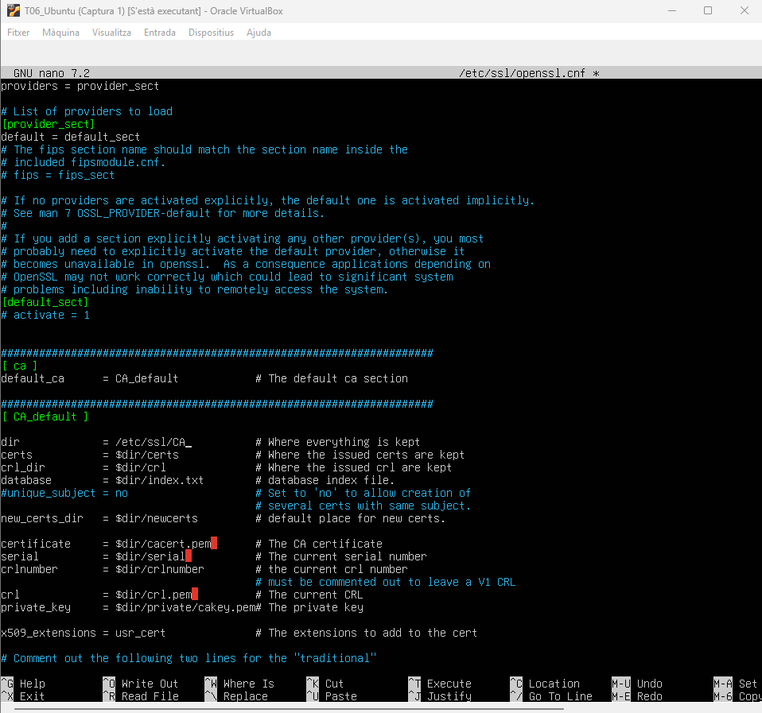
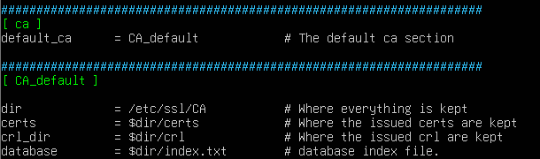

#### 2. Crear l'estructura de directoris per a la CA i inicialitzar els fitxers necessaris:
#### sudo mkdir -p /etc/ssl/CA/certs /etc/ssl/CA/crl /etc/ssl/CA/newcerts /etc/ssl/CA/private
#### sudo touch /etc/ssl/CA/index.txt
#### sudo echo 001 > /etc/ssl/CA/serial o sudo echo "C001" > /etc/ssl/CA/serial

Ara creem l’estructura de directoris i fitxers necessaris:

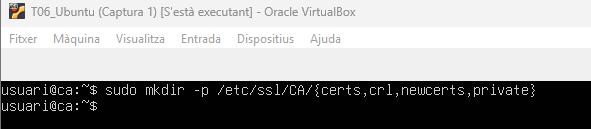
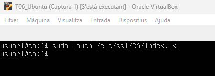

Ara inicialitzem els fitxers necessaris. Ens han dit que bàsicament la següent comanda, no funcionava (tal com doncs estava posat al enunciat) correctament com: 001, que ho féssim amb una; C davant dels 0.

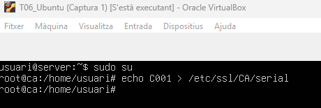

#### 3. Generar la clau privada de la CA i el certificat d’autoritat:
#### sudo openssl req -new -x509 -keyout demoCA/private/cakey.pem -out demoCA/cacert.pem
#### Organization Name: nom de la vostra organització (Nexus 1, Nexus 2, …).
#### Common Name: ca.nexusX.test.

Posem la següent comanda, per generar la clau privada de la CA i el certificat d’autoritat, com podem veure, ho generem:

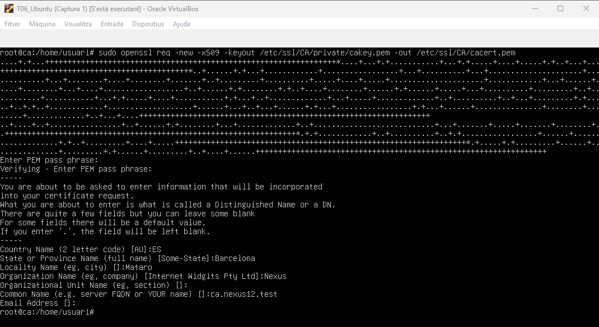

### Fase 3: Generació de la clau i certificat d’usuari

#### 1. Generar una clau privada per a l’usuari i la sol·licitud de certificat: openssl req -new -keyout userkey.pem -out userreq.csr

Ara el que fem és posar la següent comanda per generar una clau privada per a l’usuari i la sol·licitud de certificat

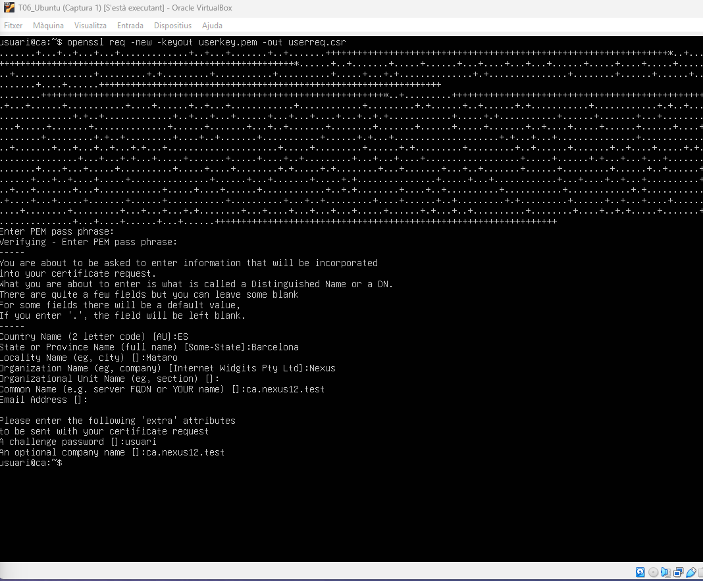

#### 2. Signar la sol·licitud amb la vostra CA: openssl ca -in userreq.csr -out usercert.pem

Signem la sol·licitud amb la nostra CA:
Posem: usuari, en:
Enter pass phrase for /etc/ssl/CA/private/cakey.pem:
* Hem posat usercet.pem i era: usercert.pem, perquè és sàpiga com s’escriu correctament.

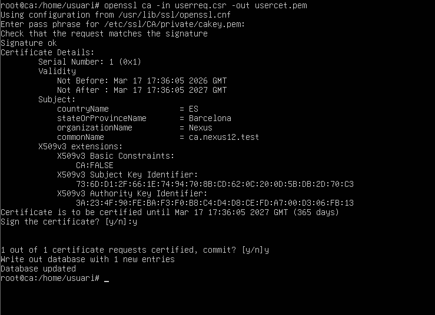

#### 3. Exportar el certificat en format PKCS#12 (.pfx): openssl pkcs12 -export -out CertUser.pfx -inkey userkey.pem -in usercert.pem

Seguidament exportem el certificat en format PKCS#12 (.pfx):

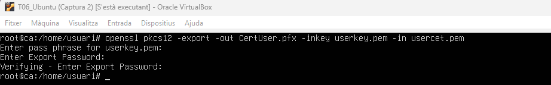

#### 4. Assignar una contrasenya d’exportació.

Ja a l’anterior pas ho podem fer. Hem posat: usuari.

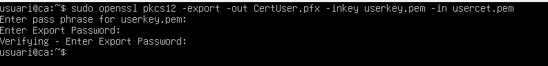
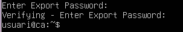

### Fase 4: Distribució de Certificats (Servidor - Client)

#### L'usuari ha de rebre tant el certificat de la CA com el seu certificat personal. Proposem dues alternatives per a l'empresa:

Escollim un mètode:

#### Mètode 1 (Bàsic): Ús del protocol SCP.
#### Per facilitar la transferència, copieu tant el certificat arrel com el certificat d'usuari al directori accessible al client, i configureu els permisos adients als fitxers (per exemple, chmod 777 CertUser.pfx).

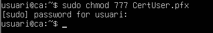

#### Instal·leu el servei SSH al servidor Ubuntu (apt install ssh). Al client Windows, obriu un intèrpret de comandes (PowerShell) i executeu les comandes scp amb la IP del servidor per descarregar cacert.pem i el certificat .pfx.

Instal·lem SSH al servidor (de fet a l'instal·lació ja havíem escollit l'opció d’instal·lar SSH).

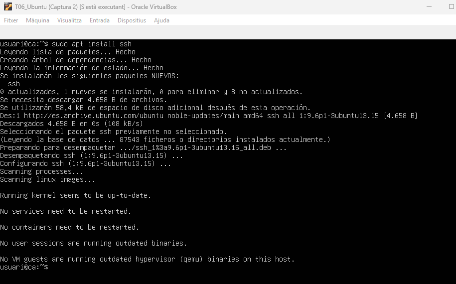

Al client Windows, obrim un intèrpret de comandes (PowerShell) i executem les comandes scp amb la IP del servidor per descarregar cacert.pem i el certificat .pfx.

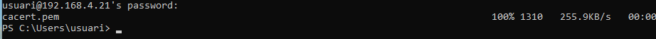
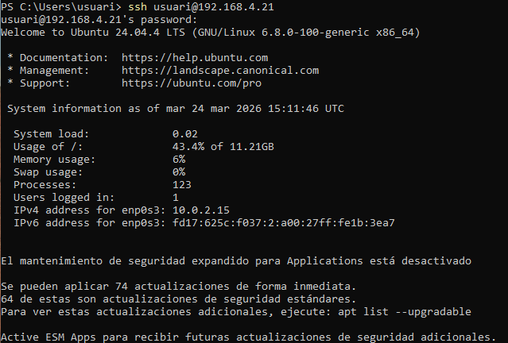

### Fase 5: Instal·lació de Certificats al Client

#### 1. Obriu un terminal amb privilegis d'administrador al client Windows i instal·leu el programari de lectura PDF mitjançant el gestor de paquets Winget: winget install Adobe.Acrobat.Reader.64-bit --accept-source-agreements --accept-package-agreements.

Instal·lat:

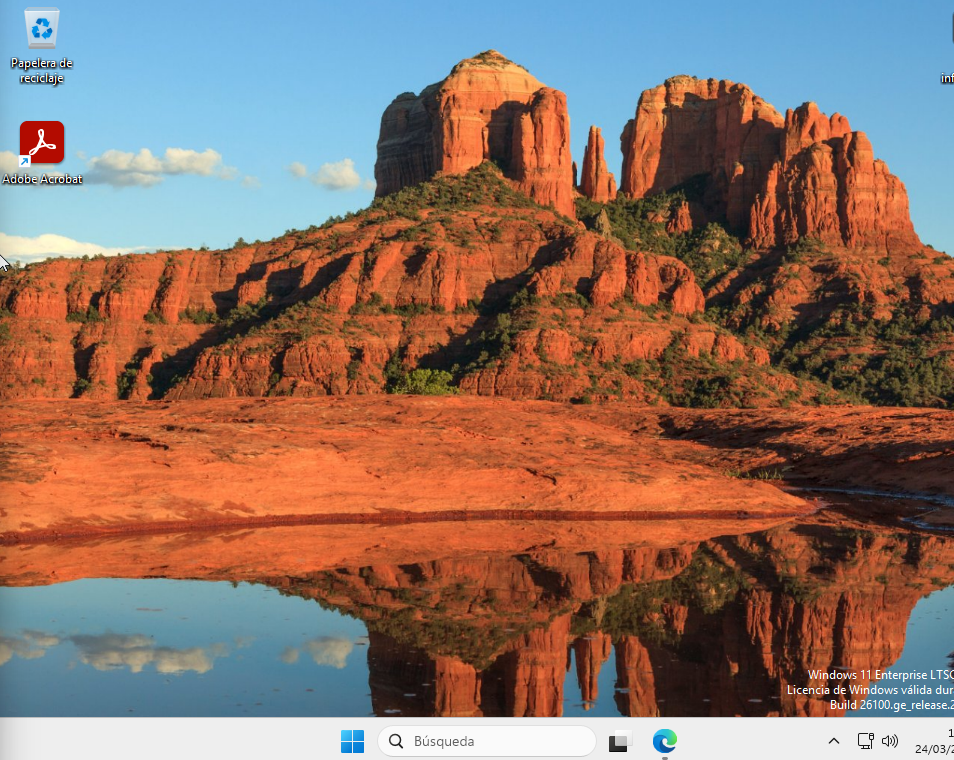

#### 2. Executeu la consola d'administració de certificats amb la comanda certmgr.msc.

Executem la consola d'administració de certificats amb la comanda certmgr.msc i entra:

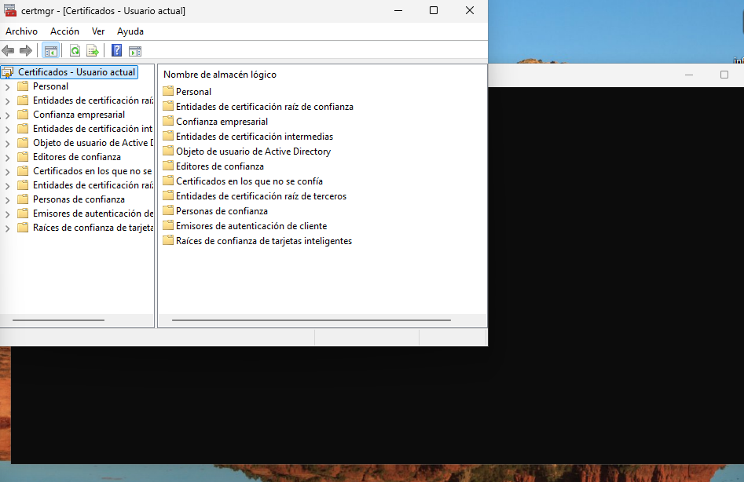

#### 3. A la branca d'Entitats de confiança arrel, importeu el certificat del servidor (cacert.pem) perquè el sistema operatiu reconegui la vostra pròpia CA com a segura.

A la branca d'Entitats de confiança arrel, importem el certificat del servidor (cacert.pem) perquè el sistema operatiu reconegui la nostre pròpia CA com a segura.

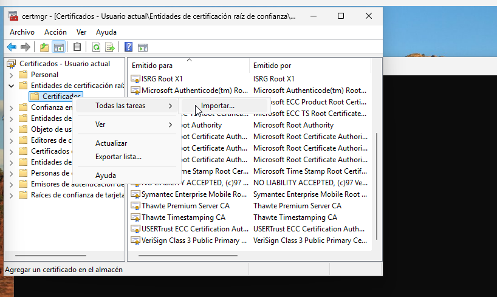

#### 4. Seguidament, a la secció Personal, importeu el certificat d'usuari i introduïu la clau de protecció que vau establir al servidor durant l'exportació.

Seguidament, a la secció Personal, importem el certificat d'usuari i introduïum la clau de protecció que vam establir al servidor durant l'exportació.

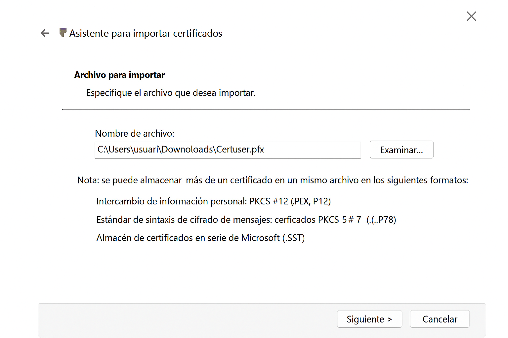

Contrasenya i incloure totes les propietats extenses.

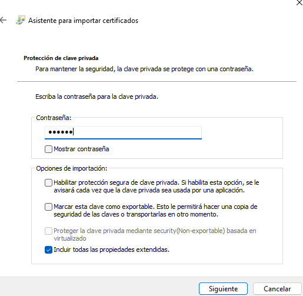

Posem l’opció: Col·locar tots els certificats en el següent magatzem i escrivim en Magatzem de certificats: Entitats de certificació arrel de confiança.

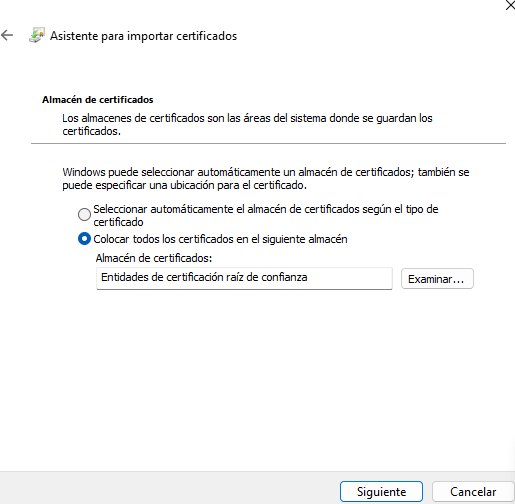

Especifiquem i Finalitzem.

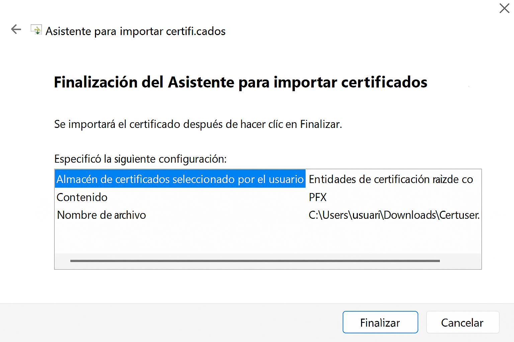

Sí, confirmem.

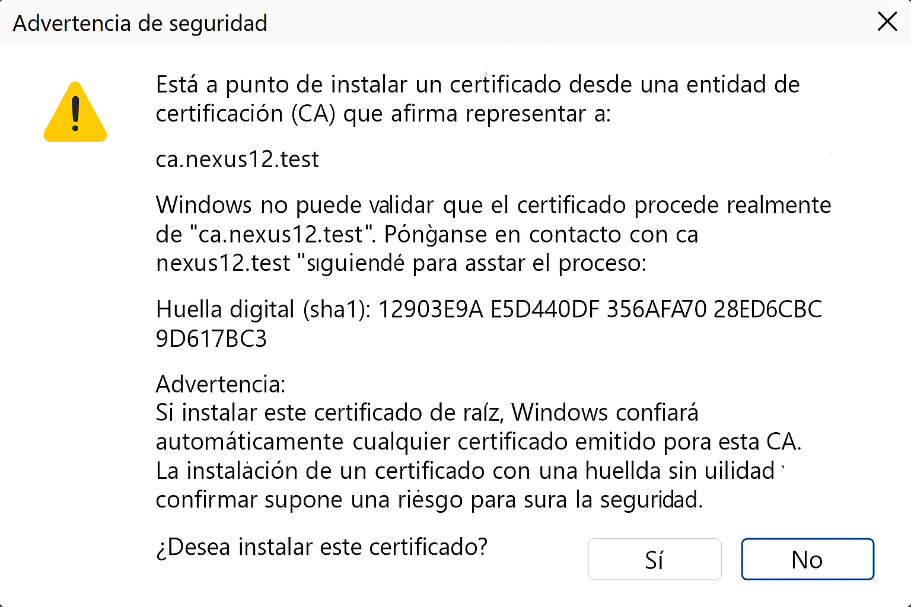

### Fase 6: Signatura Digital d'un Document PDF

No l’hem pogut fer perquè no ens ha donat temps.

#### 1. Creeu un document PDF qualsevol (una factura simulada de la vostra empresa cap al client) i obriu-lo amb Adobe Acrobat Reader.
#### 2. Dins l'apartat de Totes les eines, accediu a Usar un Certificat i premeu Signar.
#### 3. Dibuixeu l'àrea on s'aplicarà la signatura i trieu el vostre certificat recentment instal·lat a la finestra desplegable. * Deseu i bloquegeu el document (si així ho desitgeu). Finalment, obriu de nou el PDF per verificar que el panell de signatures valida l'autoria sense errors, confirmant que tot el procés criptogràfic funciona correctament.

[Anar a l'enunciat](../Tasca06/README.md)       
[Anar a la pàgina inicial](../README.md)
