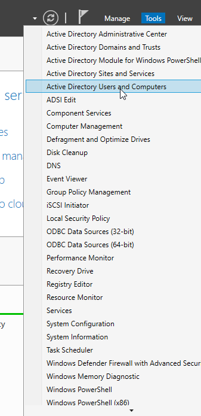
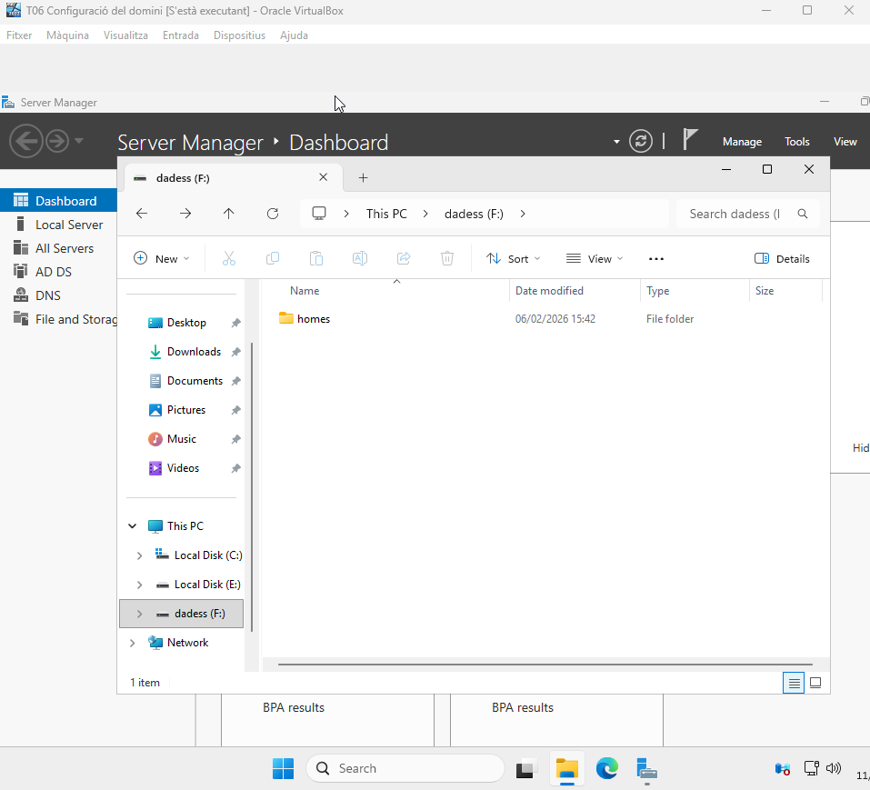
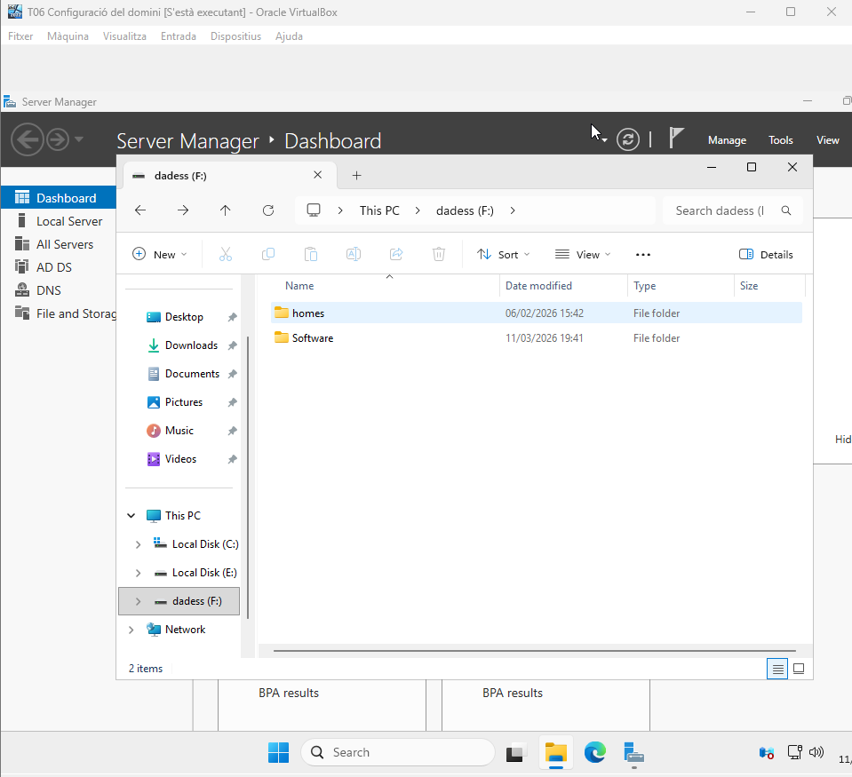

# TRANSLÒGIC: ADMINISTRACIÓ AVANÇADA I SEGURETAT CORPORATIVA

***Vaig borrar la meva màquina virtual del projecte anterior, aleshores per no començar de 0, vaig exportar la màquina del Pol Hernandez, per si és veu diferent domini i tot això.**

| 1. Polítiques de Seguretat i Contrasenyes (Seguretat Corporativa) |
|----------------------------------------|

- El client exigeix endurir la política de contrasenyes per evitar accessos no autoritzats:
- Política Global: Modifiqueu la Default Domain Policy perquè tots els membres del grup personal (és a dir, tot el domini) hagin de tenir una contrasenya de, com a mínim, 8 caràcters.           

En Server Manager, en Tools (Eines) anem a Group Policy Management (Gestió de polítiques de grup).   

Seguidament cliquem en Domains (Dominis), translogic13.test, quan es desplega fem clic dret en Default Domain Policy (Política de domini per defecte) i Edit…

Ara fem clic en Policies (Polítiques), després en Windows Settings (Configuració del Windows), Security Settings (Configuració de seguretat) i en Account Policies (Polítiques del compte) clic en Password Policy (Política de contrasenyes):

Ara anem a Relax minimum password length limits (Relaxa els límits mínims de longitud de contrasenya) i marquem la casella Define the policy setting (Defineix la configuració de la política) i l’habilitem.

Ara en Minimum password length (Longitud mínima de la contrasenya) posem 8 characters.

Resultats:

[Anar a l'enunciat](../Tasca07/README.md)  
[Anar a la pàgina inicial](../README.md)
