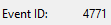

# VIGILÀNCIA I AUDITORIA DE SISTEMES

***Vaig borrar la meva màquina virtual del projecte anterior, aleshores per no començar de 0, vaig exportar la màquina del Pol Hernandez, per si és veu diferent domini i tot això.**

| 1. Monitorització de Recursos |
|----------------------------------------|

- **El client vol assegurar-se que el nou servidor dimensionat suporta la càrrega de treball.**
- **Accediu al Monitor de Rendiment o al Gestor de Tasques del servidor.**

Accedim al Gestor de Tasques del servidor:

- **Realitzeu una captura on es vegi clarament l'estat actual de la CPU i la Memòria RAM disponible.**

Estat actual de la CPU i la Memòria RAM disponible:

- **Interpreteu breument les dades: El servidor està saturat o treballa sense estrès?**

- El servidor no està saturat.   
- La CPU només treballa al 28%, i això indica que té capacitat de sobres.     
- La memòria RAM està al 75%, que és un ús elevat però encara estable i sense signes d’estrès greu.      
- La RAM està bastant usada, però el servidor encara funciona bé, però sí que doncs s’ha de vigilar. Aleshores doncs el servidor funciona correctament i sense estrès.

| 2. Configuració d'Auditoria de Seguretat |
|----------------------------------------|

- **Per detectar possibles atacs de força bruta (intents d'endevinar contrasenyes), heu d'activar el registre d'accessos.**

Escollim: Audit account logon events, perquè aquest és per inicis de sessió, básicament controla quan un usuari intenta iniciar sessió al sistema, serveix per detectar entrades correctes i errors de contrasenya.

Audit object access controla qui toca (o intenta tocar) recursos concrets del sistema, o sigui controla quan un usuari intenta accedir a fitxers, carpetes o recursos del sistema, serveix doncs per veure qui obre, modifica o intenta accedir a un recurs.

- **Configureu la política d'auditoria (via GPO o política local del servidor) per auditar els successos d'inici de sessió.**
- **És imprescindible que activeu tant els èxits (per saber qui entra) com els fracassos (per saber qui intenta entrar sense permís).**

Una vegada escollit, anem a Group Policy Management, translogic13.test, després a Default Domain Policy, Edit…       
Ara en Computer Configuration, Policies, baixem el desplegable, Windows Settings, baixem el desplegable també, Security Settings, tornem a baixar el desplegable, Local Policies i ja ara, baixant de nou el desplegable, entrem a Audit Policy:

![- Configureu la política d'auditoria (via GPO o política local del servidor) per auditar els successos d'inici de sessió.
-És imprescindible que activeu tant els èxits (per saber qui entra) com els fracassos (per saber qui intenta entrar sense permís).
Una vegada escollit, anem a Group Policy Management, translogic13.test, després a Default Domain Policy, Edit…       
Ara en Computer Configuration, Policies, baixem el desplegable, Windows Settings, baixem el desplegable també, Security Settings, tornem a baixar el desplegable, Local Policies i ja ara, baixant de nou el desplegable, entrem a Audit Policy:](Img/Imatge04.png)

Seguidament entrem a Audit account logon events, i marquem les caselles de: Define these policy settings (Defineix aquests paràmetres de política), en Audit these attempts: Success i Failure (Audita aquests intents: Èxit i fracàs).

Resultat:

| 3. Simulació d'Incidents (Hacking Ètic) |
|----------------------------------------|

**Ara posareu a prova el sistema que acabeu de configurar.**

- **Tanqueu la sessió actual.**
- **Intenteu iniciar sessió amb un usuari existent (ex: un usuari de magatzem) però introduint la contrasenya incorrecta expressament.**
- **Repetiu aquest procés 3 o 4 vegades seguides.**

Tanquem la sessió actual.        
Ara intentem iniciar sessió amb un usuari existent (Jan Fernandez) però introduint la contrasenya incorrecta expressament. Repetim aquest procés 3 o 4 vegades seguides.

- **Finalment, inicieu sessió correctament amb l'administrador.**

Iniciem sessió correctament amb l'administrador:

| 4. Anàlisi Forense (Event Viewer) |
|----------------------------------------|

**Actueu com a pèrits informàtics per trobar les proves de l'intent d'intrusió anterior.**

- **Obriu el Visor d'Esdeveniments (Event Viewer).**

Obrim el Visor d'Esdeveniments (Event Viewer).

- **Aneu al registre de Seguretat.**

Anem al registre de Seguretat.

- **Busqueu els esdeveniments recents que corresponguin als vostres intents fallits.**
- **Feu clic en un dels esdeveniments i mostreu-ne els detalls (usuari que ho ha intentat, hora, IP d'origen si n'hi ha).**

Busquem els esdeveniments recents que corresponguin als nostres intents fallits.
Fem clic en un dels esdeveniments i mostrem els detalls (usuari que ho ha intentat, hora…).
He fet l’inici corresponent a las 18:52, què és l’hora que ens surt corresponentment.

**Tasca d'investigació:** Localitzeu l'Event ID (identificador de l'esdeveniment) que correspon a un "intent d'inici de sessió fallit".

L'Event ID (identificador de l'esdeveniment) que correspon a un "intent d'inici de sessió fallit":

Seria Event ID: 4771.

| Què cal lliurar |
|----------------------------------------|

Informe d'Auditoria:

- Captura dels recursos del sistema amb la vostra interpretació.
- Captura de la configuració de la política d'auditoria activada.
- Evidència forense: Captura clara del Visor d'Esdeveniments on es vegin els errors d'inici de sessió generats durant la simulació.

**Resposta tècnica:** Indiqueu quin és el número d'ID (Event ID) que Windows assigna als errors d'inici de sessió.

L’Event ID que Windows assigna als errors d’inici de sessió és el 4771.
Què bàsicament l’Event ID 4771 és: contrasenya incorrecta (intent d’inici de sessió fallit).

[Anar a l'enunciat](../Tasca08/README.md)  
[Anar a la pàgina inicial](../README.md)
